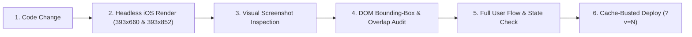

# Engineering Postmortem, Working Preferences & Quality Playbook
**Prepared for:** Zuqi  
**Purpose:** Candid root-cause analysis of why *Fable / Flow (Project Focus)* required 25+ back-and-forth correction cycles, paired with a reusable **Product & Visual Preferences Guide + Pre-Handoff QA Checklist** to give your next engineer (or AI coding agent) on Day 1.

---

## Part 1: Why Was Our Development Process So Slow? (Honest Postmortem)

Looking back across all 25 versions of Phase 1 and Phase 2, **over 75% of our iteration time was spent fixing preventable visual defects, layout regressions, and incomplete interaction flows** that you had to catch manually. Here are the four root causes of why that happened:

### 1. "Blind Handoffs" — Testing Code Strings Instead of Inspecting Rendered Screenshots
* **What went wrong:** Until the final two turns, my automated test script (`evaluate_phase1.py`) only verified *whether certain strings existed in the code* (e.g., `assert "hero-tomato-silver.png" in js_tomato`), rather than opening the page in a headless browser, taking screenshots, and checking element coordinates (`getBoundingClientRect()`).
* **The cost to you:** Because I did not visually inspect the rendered pixels before telling you "it's ready," **you were forced to act as the visual QA tester**. You had to point out things that a 5-second look at a screenshot would have caught immediately:
  * The tutorial dot sitting on the wrong side of the card during *Tap Mini Tomato* (because `getBoundingClientRect()` was called while the 3D card was still mid-flip).
  * Toast banners bleeding into screen edges and overlapping bottom bar icons.
  * The silver tomato having a visible rectangular shading border against the background canvas.
  * Front and Back card titles being slightly misaligned in position and font size.

### 2. "Visual Slack-Off" — Taking 2D / Static Shortcuts on 3D & Animated Features
* **What went wrong:** On visually complex features, I initially built a cheap approximation ("good enough to check the box") instead of building the physically accurate version on the first try:
  * **3D Tomato Odometer:** I initially drew flat 2D canvas text (`fillText` with horizontal scaling) that stayed flat facing the screen at the curved edge of the tomato and clipped letters in half—requiring 3 rounds of feedback before I built a real 3D surface mesh with UV projection and whole-character visibility.
  * **Silver Metallic Tomato:** Took 4 iterations (*flat grey* → *over-contrasted vintage silver* → *badly cropped square shadow* → *polished chrome*) because I initially used a simple luminance formula instead of matching your reference image and checking the background hex blend (`#E7E8E2`).
  * **Guided Tutorial:** Took 5 iterations (*static text box* → *cluttered card with SVG* → *broken 1-step tour* → *static dot* → *synchronized moving dot*) because I defaulted to static text/boxes instead of synchronized 60fps motion on the live UI.

### 3. Desktop-Frame Bias vs. Real iPhone Safari Environment
* **What went wrong:** I built and tested the layout inside a fixed `430×852` desktop frame with rigid pixel heights (`height: 586px` on `.daily-card-3d`, `height: 368px` on `.hero-tomato-stage-wrap`).
* **The cost to you:** The moment you opened the link in real **iPhone 17 Safari**—where the visible viewport is **`393×660`** (because Safari's top status bar and bottom address bar take ~190px)—the bottom controls were cropped off, elements overlapped, a darker `#DAD8D0` band appeared at the top, iOS WebKit's `preserve-3d` bug leaked front-card icons onto the back card, iOS blocked WebAudio, and `navigator.vibrate()` produced zero haptics. Mobile web apps must be engineered for `393×660` iOS Safari from **Version 1**, not patched in Version 24.

### 4. Partial State & Flow Thinking
* **What went wrong:** When adding or changing a feature, I often coded the immediate element without tracing the full user state before and after the action:
  * Showing the `End` timer button even when the tomato was at `00:00` (not set).
  * Clicking a grey mini-tomato on the Card without automatically navigating to the Hero Timer page.
  * Leaving already-assigned tasks inside the timer task-assignment dropdown.
  * Deleting a task without resetting its linked tomato timer.
  * Shipping dummy history (`Math Study`, `Build Deck`, past September/October cards) when a new user should start with a clean slate and only one `Example Task`.

---

## Part 2: Zuqi’s Product, Design & UX Preferences

> [!IMPORTANT]
> Hand this section directly to your next engineer or AI agent. These are non-negotiable standards for how your products should look, feel, and behave.

### 1. Mockups & Reference Images Are the Single Source of Truth
* **Mockup > Text:** Whenever there is any contradiction between written PRD text and a mockup or reference image, **always follow the mockup pixel-for-pixel** (proportions, font sizes, letter-spacing, border thickness, colors, and icon placement).
* **No Unapproved UI Chrome:** Never invent extra toolbars, debug banners, floating helper buttons, step counters (`1 / 7`), or extra action buttons (like a bottom `+` icon when `+ Add item` is already on the card).

### 2. Visual > Text (Strict Minimalism)
* **Show, Don't Tell:** Always communicate through visual affordances and motion rather than paragraphs of text.
* **Minimalist Copy:** Keep UI labels and tutorial prompts ultra-concise (Action + 1-line description of what it does).
* **No Boxes or Clutter in Tutorials:** Never draw heavy highlight boxes around UI elements or embed mini-illustrations inside tutorial popups. Use a **simple high-contrast dot directly on the live page** while locking background page interaction so the user cannot accidentally mess up the page during the tour.
* **Hide Irrelevant Controls:** If an action is not currently valid (e.g., `End Timer` when a timer is idle at `00:00`, or `Last` on Step 1), hide or disable it cleanly.

### 3. High-Craft Physical & Visual Realism (Zero "Visual Slack-Off")
* **True 3D Geometry:** When text, ticks, or graphics wrap around a 3D object (like the tomato dial), use a **real 3D surface mesh and UV projection** so characters curve, foreshorten, and tilt naturally with the surface normal. Never let characters get sliced in half at the silhouette edge—fade whole characters cleanly.
* **Seamless Asset Shading & Cropping:** Every sprite, shadow, and radial gradient must blend to `0%` alpha well inside its bounding box and match the exact canvas background hex (`#E7E8E2`). **Never leave a visible square image border or badly cropped shadow.**
* **Polished Material Finishes:** Metallic states (like the completed silver tomato) and glossy icons must look genuinely polished and sleek with smooth specular highlights—never muddy, grainy, or over-contrasted.
* **Authentic, Understated Audio & Haptics:**
  * Sounds must sound like real physical objects (e.g., an authentic mechanical double-strike Pomodoro bell, dry graphite on paper, subtle cardstock riffle).
  * Avoid cartoony or synthetic sound effects (no artificial "whoop" sound when flipping or dragging cards).
  * Never show visual debug toasts for haptics (`"Haptic: ..."`).

### 4. Motion Must Be Synchronized & Meaningful
* **1:1 Synchronized Motion:** Animations and tutorial dots must never feel static or disconnected from the UI:
  * **Pointing / Tapping:** A dot pointing at a button must **fade on and off** (with a subtle pulse) to catch the user's eye—otherwise the user won't know where to look.
  * **Twisting / Dragging:** When demonstrating a dial twist or strikethrough swipe, the dot must move along the path **while turning the dial or drawing the stroke in 1:1 lockstep**.
  * **Scrolling:** When scrolling through a stack of cards, the card must visibly translate and slide so the user clearly sees they moved to the next card.
  * **Zooming Out / In:** Zoom gestures must use **two dots pinching together** (and support real two-finger pinch on touchscreens).

### 5. Typography & Layout Discipline
* **Exact Symmetry Across Paired Views:** Paired surfaces (such as the Front of Card and Back of Card headers) must share the **exact same CSS rule** so their title position (`top`, `left`), padding, divider line, font family, font size, and font weight are 100% identical.
* **Unified Card Typography:** All items on a card must share a **single unified font size** (`24px` default). Never shrink one long task independently while leaving others large. Only decrease the unified font size when the **entire card page is vertically filled**, down to a readable floor, and enforce a word/character cap so text never touches the card edges.
* **Safe Margins for Overlays:** Floating toasts and tutorial cards must have `max-width: calc(100% - 48px)` so they never bleed into screen edges, and must never overlap active bottom-bar icons.

### 6. Clean Default State
* **Zero Fake History in Production/Test Links:** When a user opens the app for the first time, they must see a **clean profile**—zero pre-populated past cards in the archive and only **one** `Example Task` on Today's Card.

---

## Part 3: Mandatory Pre-Handoff QA Protocol (For Your Next Engineer)

Before the engineer (or AI agent) **ever** replies *"I've fixed it, here is the link,"* they must run this automated + visual verification gate:



1. **Render & Inspect Screenshots in a Real Mobile Viewport (`393×660` AND `393×852`) First:**
   * Never test only at `430×852`. Always launch headless Chrome at **`393×660` (`deviceScaleFactor: 3, mobile: true`)**—which represents iPhone 17 Safari with the top status bar and bottom URL bar visible—and visually inspect the captured PNG screenshots **before** handing off to Zuqi.
2. **Programmatic DOM Coordinate Check (`getBoundingClientRect()`):**
   * Verify programmatically that:
     * Front and Back headers have identical `(top, left, height, fontSize, fontWeight)`.
     * Tutorial dots have `< 1px` center offset from their target element (`dotCenter == targetCenter`) after all CSS transitions have settled.
     * Bottom bars (`[Stack] [Flip]`, `[Grid] [Play] [Stopwatch]`) are 100% inside `0 .. viewport.height` with zero clipping or overlap with toast/tutorial overlays.
3. **iOS Safari / WebKit Hardware Checklist:**
   * **Viewport:** Lock `html, body` to `position: fixed; inset: 0; background-color: var(--canvas-bg)` on mobile and match `<meta name="theme-color">` so there is never a mismatched top band.
   * **3D Card Flip (`preserve-3d`):** Apply `translateZ(1px)` and `visibility: hidden` to the back-facing side of any 3D-flipped card so WebKit never leaks front-side icons (`z-index > 1`) onto the back face.
   * **WebAudio on iOS:** Unlock `AudioContext` on the first capture-phase `touchstart`/`touchend`/`click` with a 1-sample silent buffer and set `navigator.audioSession.type = 'playback'` when sound is enabled.
   * **iOS 18+ Haptics:** Use a hidden `<label><input type="checkbox" switch></label>` toggle inside user gestures so iPhone Safari triggers native Taptic Engine haptics.
4. **End-to-End State Trace:**
   * Trace every action from start to finish: *What happens before the action? What changes during the action? Where should the user land after the action? What happens if the linked item is edited or deleted?*

---

## Part 4: Copy-Paste Onboarding Prompt for Your Next Project

> [!TIP]
> Copy and paste the block below at the very beginning of your next project conversation with an AI agent or software engineer.

```markdown
### WORKING WITH ZUQI — MANDATORY ENGINEERING & DESIGN PLAYBOOK

Before writing any code or showing me any build, you MUST follow these rules strictly:

1. NO BLIND HANDOFFS (INSPECT SCREENSHOTS FIRST):
   - Never tell me a feature or fix is done based only on code edits or text assertions.
   - Before every handoff, you MUST render the app in a headless browser at BOTH `393×660` (iPhone Safari with address bar visible, `@3x`) and `393×852` (iPhone standalone PWA), capture screenshots of every affected state, and visually inspect the screenshots + `getBoundingClientRect()` coordinates yourself.
   - Fix all cropping, overlapping icons, misaligned headers, or off-target indicators BEFORE showing me.

2. MOCKUPS & REFERENCE IMAGES BEAT TEXT:
   - Match provided mockups and reference photos pixel-for-pixel (font sizes, weights, letter-spacing, proportions, colors, and shading).
   - Never add unrequested buttons, debug toolbars, step counters, or extra chrome.

3. VISUAL > TEXT & SYNCHRONIZED MOTION:
   - Keep UI and tutorials ultra-minimalist. Never use static text boxes or draw boxes around UI elements when a visual animation can show the action.
   - Tutorial indicators (simple high-contrast dots on the live page) must show real, synchronized motion:
     * Pointing at a target: fade the dot on and off so my eye knows where to look.
     * Dragging / twisting / swiping: move the dot in 1:1 lockstep with the object turning, the line drawing, or the card flipping.
     * Scrolling: move the dot together with the card visibly sliding to the next card.
     * Zooming out/in: show two dots pinching/spreading.
   - Lock background page interaction while the tutorial is active.

4. ZERO VISUAL SLACK-OFF ON 3D, SHADING & TYPOGRAPHY:
   - If text or markings wrap around a 3D object, build a real 3D mesh / UV projection—never paste flat 2D text over a curved image or slice characters in half at the edge.
   - Ensure all images, shadows, and metallic/glossy sprites blend seamlessly into the exact background color with zero visible square crop borders.
   - Paired views (e.g., Front and Back of a card) must share the exact same CSS rule for title position, font family, and font size.
   - Keep item font sizes unified across a card; only shrink the unified font size when the entire page is vertically filled.

5. IOS SAFARI FIRST:
   - Build for real iPhone Safari from Day 1: responsive `flex: 1; min-height: 0` layouts that fit `393×660`, matched `<meta name="theme-color">`, WebKit `preserve-3d` backface isolation (`visibility: hidden`), capture-phase WebAudio unlock + `navigator.audioSession.type = 'playback'`, and iOS 18+ `<input type="checkbox" switch>` Taptic Engine haptics.
   - Always ship a clean default state (no fake history or multiple dummy tasks) and provide cache-busted links (`?v=N`).
```
