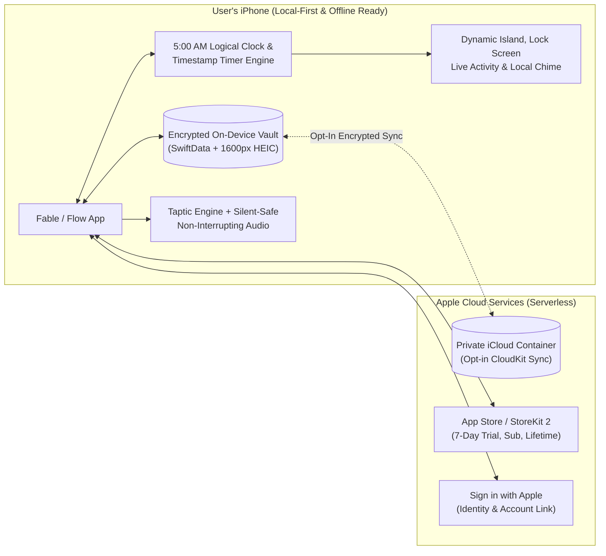
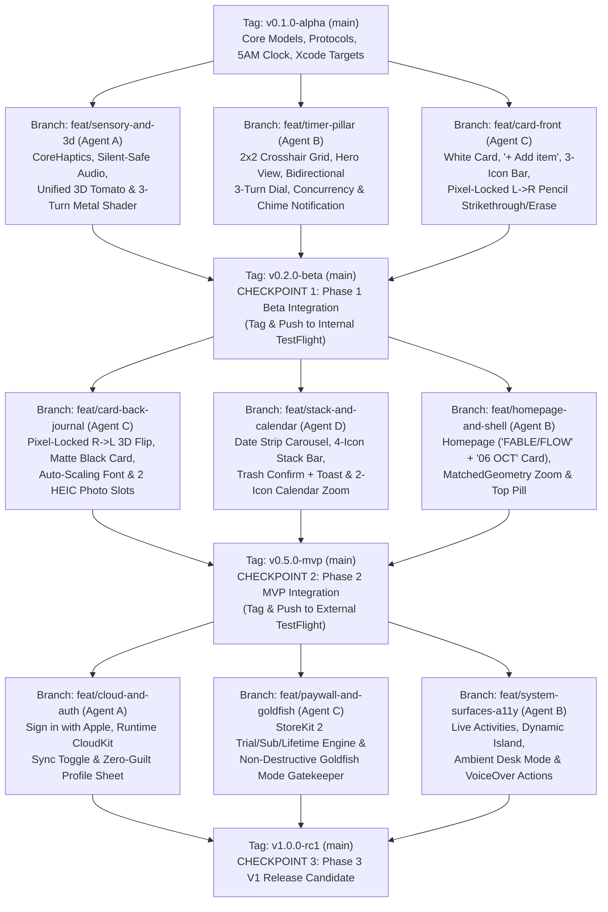

# Fable / Flow — Master Product Requirements Document (v4) & Engineering Implementation Plan

> **Authoritative Handoff Specification:** This document contains the complete, contradiction-free **Product Requirements Document (v4)** (100% aligned with the UI Mockups), followed by **Part 1: Technical Plan Overview**, **Part 2: Detailed File-by-File Implementation Plan**, and **Part 3: Mandatory Acceptance & Evaluation Criteria**.

---

# Section 0: Product Requirements Document (v4): Fable / Flow

**Target Platform:** iOS 17.0+ (`Swift` / `SwiftUI` / `RealityKit` & `Metal` / `CoreHaptics` / `SwiftData` / `CloudKit` / `ActivityKit` / `StoreKit 2`)

## 1. Idea & Background

**A tactile, digital-analog tool space that increases a user's sense of lived fulfillment by restoring daily focus, accomplishment, and presence without coercive gamification, complex hierarchies, or productivity guilt.**

Modern productivity applications force users to choose between fragmented "app stacks" (e.g., *Todoist + Forest + Day One*) that induce high context-switching friction, or monolithic "all-in-one" systems (e.g., *Notion, Asana, TickTick*) that demand steep onboarding curves and end up creating cognitive overload.

Project **Fable / Flow** bridges this divide by delivering a calm, hyper-minimalist, physical-first environment. Built around two tactile objects—a **dual-sided index card** and a **3D heirloom tomato Pomodoro timer**—it replaces abstract dashboards with organic, physical tools for daily planning, deep focus, and evening reflection.

## 2. Goals, Guiding Principles & Explicit Non-Goals

### Goals
- **User Value:** The tools are first and foremost functional and helpful. The experience provides stress-free cognitive grounding through calm, tactile interaction. Users leave feeling fulfilled by concrete daily accomplishments rather than trapped in digital maintenance loops.
- **Product & Business Value:** An "anti-tech," sensory-rich interface model on iOS that achieves strong organic retention through intrinsic tactile delight rather than addictive games, monetized via a transparent 7-day trial and hybrid subscription / one-time lifetime unlock.

### Guiding Principles
- **Simplicity Over Systems:** Reality is where life happens, not inside an app. Tools are single-purpose, obvious, and devoid of multi-level configuration menus.
- **Tactile & Organic Skeuomorphism:** Digital objects obey physical intuition—they twist and unwind with stepped haptic resistance, cross out with audible graphite friction, flip with crisp cardstock weight, and settle with natural mass.
- **Zero-Guilt Architecture:** No broken streak penalties, no automatic rollover of unfinished tasks piling up, no red overdue badges, no performance/analytics charts, and no anxiety-inducing marketing/guilt push notifications.
- **Local-First & Ephemeral Option ("Goldfish Mode"):** Complete utility without forced account creation. Users operate locally without cloud sync by default, and free-tier users after the trial retain a 1-card, 1-timer daily experience without losing their previously archived trial cards on-device.

### Explicit Non-Goals
- **Not a Complex Project Management Suite:** No Gantt charts, subtasks, task dependencies, team assignments, or Kanban boards (e.g., *Asana / Trello / Lunatask*). Tasks are strictly flat and capped at **6 main tasks per card**.
- **No Automatic Task Rollover:** If a user does not finish a task by the end of the day (5:00 AM cutoff), it remains uncrossed on that day's card as an honest snapshot in the archive rather than rolling over to clutter tomorrow's card.
- **Not a Behavioral Habit Tracker or Analytics Dashboard:** No mandatory 66-day habit loops, streak counts, focused-hour trend graphs, or dopamine-driven conditioning (e.g., *Fabulous / Habi*).
- **Not a Clinical Wellness/Meditation App:** No guided meditation voice tracks or generic daily affirmations (e.g., *Calm*).
- **No Generative AI Rewriting:** Thoughts and reflections remain 100% the user's own authentic words—no AI text generation or automated summarizing.

## 3. Business & Monetization Model
- **Free-to-Download with 7-Day Full-Access Trial:** New users receive 7 days of unrestricted access immediately upon download (no upfront paywall or credit card required) to build their first week-long **Card Stack** (up to 6 tasks/day, all 4 Pomodoro timers, Back-of-Card evening journal with up to 2 photos, Stack & Calendar archive).
- **Hybrid Paywall (Post-Trial Unlock via StoreKit 2):**
  - **Monthly Subscription:** Low-commitment recurring access.
  - **Annual Subscription:** Discounted yearly access.
  - **Lifetime One-Time Purchase:** Positioned as *"Buy Your Physical Tools Once"* for users who prefer ownership over subscriptions.
- **Free Tier Fallback ("Goldfish Mode"):** If a user chooses not to purchase after the 7-day trial, the app remains functional in a constrained daily mode: **1 Daily Card (Front To-Do List)** and **1 Pomodoro Timer (Top-Left Quadrant #1)** per day, resetting fresh at 5:00 AM each morning without historical Stack access, Back-of-Card journal access, or multi-device CloudKit sync. *(Cards and photos created during the 7-day trial are never deleted; they remain encrypted on-device and unlock immediately if the user subscribes or purchases Lifetime later.)*

## 4. End-to-End User Journey
1. **Morning Intake (5:00 AM Daily Reset):** The user opens the app in the morning. At **5:00 AM local time**, yesterday's card was automatically filed into the **Card Stack**, and a fresh white index card is ready on the minimalist homepage (stamped `06 OCT` in miniature). Tapping the Card zooms smoothly into Today's White Index Card stamped `TUESDAY — OCT 06`. The user taps into the task lines (or taps `+ Add item` / the bottom-right `[+]` button) to write three main tasks: `01 Math Study`, `02 Build Deck`, and `03 Pick Up Package` (up to 6 main tasks max; no subtasks).
2. **Focus Execution (Bidirectional 3-Turn Odometer Dial):** The user taps the small heirloom tomato icon next to `01 Math Study`, smoothly expanding into the **Single Big Hero Tomato** view labeled `01 / MATH STUDY`. They drag the tomato dial horizontally **Right → Left** in 5-minute (`30°`) notched increments to wind the timer (up to 180 minutes via 3 full rotations; if they overshoot, dragging **Left → Right** unwinds the dial in 5-minute notched steps). A subtle mechanical ticking haptic and escapement sound engage as the tomato begins unwinding.
3. **Interruption & Multi-Tomato Switching:** 15 minutes in, an urgent interruption arrives. The user taps **Pause (`||`)** on `01 Math Study` and taps the bottom-left **`[2×2 Grid Icon]`** to return to the **4-Pomodoro Grid View**, where four heirloom tomatoes sit in a `2×2` layout divided by subtle crosshairs (assigned tomatoes appear in distinct shades of red with inline `Play ▶ / Pause ||` and `End ■` controls below them, while unassigned tomatoes remain matte gray). While `Math Study` holds its paused state on Tomato #1, the user taps an unassigned gray tomato, selects `Pick Up Package` (or `Build Deck`) from the dark dropdown menu (`+ Custom Title...` + today's tasks), which turns that tomato into its signature shade of red. In the Hero View, they toggle the **Stopwatch (`⏱`)** button for an open-ended session and tap **Play (`▶`)**. The tomato physically rotates forward (`1 minute notch per minute`) as time counts up.
4. **Ending a Timer & Pixel-Locked Tactile Strikethrough:** The user finishes the deck and taps **End (`■`)** on the tomato, which resets that tomato's clock back to `00:00` (if a countdown reaches `00:00` on its own—whether in the foreground or locked in the background—a soft completion chime plays). Because timer completion is intentionally decoupled from task completion, the user switches back to the Card via the top `Card | Timer` pill and drags their finger horizontally **Left → Right** (`Δx > +15 px`) across `02 Build Deck`. A realistic graphite line follows their finger with pencil-scratch haptics and sound. (If they cross out an item by mistake, dragging **Left → Right** across it again erases the strikethrough.)
5. **Evening Reflection (The Right-to-Left Flip):** At night, the user swipes **Right → Left** (`Δx < -40 px`) across the card body (or taps the bottom-center `[Flip Icon]`) to turn the card `180°` over in 3D space to its **matte black reverse side** stamped `TUESDAY — OCT 06`. The user types a reflection and taps the `[+ Photo]` squares (or bottom-right `[+]` button) to attach up to 2 photos from the afternoon. As they type longer text, the typography dynamically scales down to fit the card frame, only becoming scrollable if the text reaches the `13pt` minimum font size floor.
6. **Effortless Archiving, Retroactive Edits & Permanent Trash Deletion:** The user goes to sleep without needing to manually file the card. At **5:00 AM**, the card is automatically available in the **Card Stack** and a fresh card is placed on the workspace. If the user forgot to write their reflection the night before, they can tap the bottom-left `[Stack Icon]` at any time, select yesterday's card from the top date strip (`OCT 01 02 03 04 (05) 06`), and edit its front or back retroactively—or tap the bottom-right `[Trash Can 🗑]`, confirm permanent deletion in the alert dialog, and receive a confirmation notification banner that the card was permanently removed.

## 5. Information Architecture & Page Navigation
- **Minimalist Homepage:**
  - Top Bar: Centered `'FABLE / FLOW'` title and top-right `[Profile Icon]`.
  - Canvas: Displays the Physical Card (stamped `06 OCT`) and 3D Tomato resting on a warm off-white canvas (`#EAE8E1`).
  - Tapping the Card opens **Today's Card (Front)**.
  - Tapping the Tomato opens the **4-Pomodoro Grid View (`2×2`)**.
- **Global Top Bar (Present Inside Card, Timer, Stack & Calendar Views):**
  - **Centered `Card | Timer` Segmented Pill:** One-tap toggle between the active Card view and the Pomodoro Timer view.
  - **Top-Right `[Profile Icon]`:** Opens the Account & Settings modal (Sign in with Apple, CloudKit sync toggle, ambient escapement sound toggle, subscription management; strictly no trackers or analytics trends).
- **Card Views Navigation:**
  - **Front of Today's Card (White) ↔ Back of Today's Card (Matte Black):** Switch via `Right → Left` swipe gesture (`Δx < -40 px`) on the card body or by tapping the bottom-center `[Flip Icon]`.
  - **Today's Card → Single Big Hero Tomato:** Tap the small heirloom tomato icon on the right side of any task row.
  - **Today's Card → Card Stack Viewer (Archive):** Tap the bottom-left `[Stack Icon]`.
  - **Card Stack Viewer → Today's Card:** Tap the bottom-left `[Return / Undo Arrow ↩]`.
  - **Card Stack Viewer ↔ Monthly Calendar View:** Pinch fingers inward or tap the bottom center-left `[Zoom Out Magnifying Glass 🔍-]` icon to zoom out to the Calendar View; tap any highlighted date on the calendar (or tap the bottom-right `[Zoom In Magnifying Glass 🔍+]` icon) to open that date's card in the Stack Viewer.
- **Timer Views Navigation:**
  - **4-Pomodoro Grid View (`2×2`) → Single Big Hero Tomato View:** Tap any assigned tomato body (or assign a task via dropdown and tap the tomato).
  - **Single Big Hero Tomato View → 4-Pomodoro Grid View (`2×2`):** Tap the bottom-left `[2×2 Grid Icon]`.

## 6. Detailed Functional Requirements

### #1. Minimalist Homepage & Global Navigation Bar
- **Homepage Visual Representation (Mockup Page 11 Top):**
  - Warm off-white textured canvas (`#EAE8E1`) displaying two physical objects resting on the surface:
    1. **The Daily Card:** Crisp white horizontal cardstock in a subtle frame, stamped in the top-left with `06 OCT` (`DD MMM` uppercase).
    2. **The Tomato Pomodoro:** Tactile 3D heirloom tomato timer in Deep Crimson Red with equatorial tick notches and white pointer triangle (`▲`).
- **Global Top Bar:**
  - Centered `'FABLE / FLOW'` title on Homepage; morphs into centered `Card | Timer` segmented pill inside Card/Timer/Stack/Calendar views.
  - Top-Right `[Profile Icon]`: Opens minimal account sheet (Sign in with Apple, opt-in CloudKit sync toggle, subscription management; strictly zero analytics charts, focus hour trackers, or trend graphs).

### #2. Pillar 1: Flow / Engagement (The 4-Pomodoro Timer)

#### A. The 4-Tomato Grid View (`2×2` Layout — Mockup Page 12)
- **Visual Representation:** Balanced `2×2` grid of four 3D rendered Pomodoro timers separated by subtle horizontal and vertical crosshair lines.
- **Unassigned Gray vs. Assigned Distinct Shades of Red:**
  - **Unassigned State:** Matte neutral gray (`#8E8D8A`) with a subtle centered `Tap to assign` label.
  - **Assigned State:** Transitions from gray into its quadrant's distinct heirloom shade of red, displaying the uppercase Task Title and Digital Readout (`MATH STUDY / 02:30`) centered on the tomato body, plus inline `[Play ▶ / Pause ||]` and `[End ■]` controls directly below that tomato:
    1. **Top-Left Tomato:** Deep Crimson Red (`#8B1E24`)
    2. **Top-Right Tomato:** Warm Terracotta / Vermilion Red (`#C84B31`)
    3. **Bottom-Left Tomato:** Rich Dark Burgundy / Wine Red (`#5E192A`)
    4. **Bottom-Right Tomato:** Sun-Ripened Coral / Dusty Rose Red (`#D96B52`)
- **Task Assignment & Renaming (Mockup Page 12 Bottom-Left):**
  - Tapping an unassigned gray tomato (`Tap to assign`) or tapping an existing tomato's title opens a dark floating dropdown menu directly over the tomato listing `+ Custom Title...` at the top followed by the current tasks from Today's Card (e.g., `Pick Up Package`), plus an option to clear/unassign.
  - If a tomato's title is cleared completely, the tomato immediately returns to its unassigned matte gray state.
- **4-Timer Concurrency & Controls (`Play ▶`, `Pause ||`, `End/Reset ■`):**
  - Up to 4 timers can hold an assigned/paused state concurrently. **Only 1 timer can actively tick at the same time** (starting one automatically pauses any other running timer).
  - **Pause (`||`):** Freezes the timer at its current countdown or stopwatch value.
  - **End / Reset (`■`):** Ends the focus session and resets the clock back to `00:00`.
  - **Decoupled Task Strikethrough:** A timer reaching `00:00` or being ended via `■` **never** automatically crosses out the corresponding task on the Card. Crossing off a task is always an intentional, manual `Left → Right` pencil-drag action by the user on the Card.

#### B. Single Big Hero Tomato View & Bidirectional Dial Physics (Mockup Page 11 Bottom)
- **Entering & Exiting the Hero View:**
  - Tapping an assigned tomato in the `2×2` grid (or tapping the small tomato icon next to a task on the Card) zooms smoothly into the **Single Big Hero Tomato View**, displaying the large left-aligned digital readout (`02:30`), the uppercase task title (`01 / MATH STUDY`), and the large 3D tomato in its corresponding shade of red.
  - **Bottom Control Bar (4 Icons):**
    1. **Bottom-Left `[2×2 Grid Icon]` (`⊞`):** Returns to the 4-Tomato Grid View.
    2. **Center-Left `[Play ▶ / Pause ||]`:** Starts or pauses the clock.
    3. **Center-Right `[End / Reset ■]`:** Resets the clock to `00:00`.
    4. **Bottom-Right `[Stopwatch Toggle ⏱]`:** Switches the timer between Countdown Mode and Count-Up Stopwatch Mode.
- **Countdown Mode — Bidirectional 180-Minute "3-Turn Odometer" Dial:**
  - **Winding (`Right → Left` Drag):** Dragging horizontally right-to-left across the tomato body winds the timer up in **5-minute notched increments** (`30°` per 5-min notch; `12` clicks = `360°` = `60 minutes`), up to a maximum of **180 minutes (3 full rotations / `1080°`)**.
  - **Unwinding (`Left → Right` Drag):** Dragging horizontally left-to-right across the tomato body unwinds/decrements the timer in **5-minute (`30°`) notched steps** down to `00:00`.
  - **3-Turn Odometer Shader Mechanics:** As the user rotates past 60 minutes into Turn 2 (`65–120 mins`) or Turn 3 (`125–180 mins`)—or unwinds back down—the painted numbers rolling into view from behind the 3D tomato dynamically increment/decrement via Metal shader (`0–60` on Turn 1, `65–120` on Turn 2, `125–180` on Turn 3, e.g., `130 140 150 160` above the white `▲` pointer).
  - **Unwinding & Completion Chime (Foreground & Background):** As time counts down, the tomato slowly unwinds backward toward `0` and plays a soft completion chime (`soft_chime.caf`) at `00:00`—both in the foreground and when backgrounded/locked via a synchronized local notification sound.
- **Count-Up Stopwatch Mode — Continuous Forward Rotation:**
  - Tapping `[Stopwatch Toggle ⏱]` sets the timer to `00:00` in count-up mode.
  - While counting up, the 3D tomato **physically rotates forward** at a real-time pace (`1 minute notch / +6° per minute`) with the subtle mechanical escapement tick.
- **Live Activity, Dynamic Island & Ambient Desk Mode:**
  - When backgrounded or locked, the active countdown or stopwatch projects live status to iOS Live Activities and the Dynamic Island.
  - When left open on a desk stand while running, Ambient Desk Mode keeps the screen awake (`isIdleTimerDisabled = true`) as the active tomato slowly rotates in real time.

### #3. Pillar 2: Purpose & Presence (The Dual-Sided Card & Stack)

#### A. Daily Card Lifecycle & Automatic 5:00 AM Rollover
- **Automatic Stack Saving:** Every card is automatically saved in the chronological Card Stack in real time.
- **5:00 AM Daily Boundary:** At **5:00 AM local time** each day (`currentTime - 5 hours`), the workspace automatically transitions to a fresh, blank white index card stamped with the new date, while the previous day's card resides in the Stack.
- **No Unfinished Task Rollover:** Tasks not crossed out before 5:00 AM stay uncrossed on yesterday's card in the Stack and **do not** copy over to the new card.
- **Always Editable History:** Users can open any past card in the Stack at any time to edit task text, cross/uncross tasks, write or update their evening reflection, or add/change photos.

#### B. Front of Card — Purpose / Accomplishment (White To-Do Card — Mockup Page 13 Top)
- **Visual Representation:** Crisp, textured white index card (`#FAF9F5`) stamped at the top-left with `TUESDAY — OCT 06` above a subtle horizontal divider line.
- **Strict 6-Task Limit & `+ Add item` Row (No Subtasks, No Vertical Scroll):**
  - Supports a flat list of maximum **6 main tasks (`01` through `06`)** with zero vertical scrolling.
  - When fewer than 6 tasks exist, displays a muted gray **`+ Add item`** row below the last task.
- **Editing Tasks:** Tapping directly on any task line (or `+ Add item` / bottom-right `[+]`) opens the keyboard to type or edit the task text in place.
- **Pixel-Locked Pencil Strikethrough & Erase Gesture (`Left → Right` Only):**
  - **Pixel Math Rule:** Triggered strictly when a finger drag begins inside a task row and moves horizontally **Left → Right** with `Δx > +15 px` and vertical angle within `±25°` (`|Δy| <= Δx * tan(25°)`).
  - **Cross Out:** Dragging `Left → Right` across an uncrossed task draws a dynamic, textured graphite pencil line following the finger's pixel path with pencil-scratch haptics and audio.
  - **Un-Cross (Erase):** Dragging `Left → Right` across an already crossed-out task removes/erases the pencil strikethrough.
- **Cross-Pillar Tomato Link:** A small 3D heirloom tomato icon sits on the right side of each task row (red when assigned to a timer, matte gray when unassigned); tapping it opens `SingleHeroTomatoView` synced to that task.
- **Today's Card Bottom Bar (3 Icons — Mockup Page 13):**
  1. **Left `[Stack Icon]`:** Opens the chronological Card Stack Viewer.
  2. **Center `[Flip Icon]`:** Flips Today's Card `180°` between Front (White) and Back (Matte Black).
  3. **Right `[+ Plus Icon]`:** Focuses/adds the next empty task slot on the Front (up to 6 max), or adds a photo / focuses reflection text on the Back.

#### C. Back of Card — Presence / Mindfulness (Matte Black Journal Card — Mockup Page 13 Bottom)
- **Pixel-Locked Card Flip Interaction (`Right → Left` Only):**
  - **Pixel Math Rule:** Triggered when a finger swipe moves horizontally **Right → Left** anywhere on the card body with `Δx < -40 px` and vertical angle within `±35°` (`|Δy| <= |Δx| * tan(35°)`), or when tapping the bottom-center `[Flip Icon]`. Rotates the card `180°` in 3D space accompanied by a cardstock-flip haptic and paper-whoosh audio cue.
- **Visual Representation:** Inverts to a calm matte black card (`#141413`) with clean white text (`#FAF9F5`), stamped at the top-left with `TUESDAY — OCT 06` above a subtle divider line.
- **Adaptive Typography, Optional Photos & Scroll Threshold:**
  - **Dynamic Font Scaling → Scroll Fallback:** As the user enters more journal text, the typography automatically scales down from `20pt` to a **`13pt` minimum legible floor** so longer reflections fit comfortably within the card frame. Once the text reaches `13pt` and exceeds the card frame, the text area locks at `13pt` and becomes vertically scrollable.
  - **Optional Photo Slots (0 to 2 Images):** Users can attach up to 2 photos framed side-by-side at the bottom of the black card (Mockup p. 13 bottom). When 0 or 1 photo is attached, compact minimal `[+ Photo]` square buttons allow adding photos while letting text occupy the remaining space.

#### D. Card Stack Viewer & Calendar View (Mockup Page 14)
- **Stack Detail View (Archived Cards — Mockup Page 14 Top):**
  - Displays a horizontal chronological date strip at the top (`OCT 01   02   03   04   (05)   06`) with a solid black circle on the selected date (`05`).
  - Displays the selected card in center focus with peeking neighbor card edges on left/right.
  - **Archived Card Bottom Bar (4 Icons — Mockup Page 14 Top):**
    1. **Left `[Return / Undo Arrow ↩]`:** Immediately returns the user to Today's current card.
    2. **Center-Left `[Zoom Out Magnifying Glass 🔍-]`:** Zooms out to the Monthly Calendar View (also triggered by pinching two fingers inward).
    3. **Center-Right `[Flip Icon]`:** Flips the archived card `180°` between Front and Back.
    4. **Right `[Trash Can 🗑]`:** Prompts a confirmation modal (*"Permanently delete this card? This action cannot be undone."*). Upon confirmation, **permanently deletes** the card from storage and pops up an in-app confirmation notification banner (*"Card permanently deleted"*).
- **Calendar Zoom-Out View (Mockup Page 14 Bottom):**
  - Displays vertically stacked monthly calendars (`SEPTEMBER 2026`, `OCTOBER 2026`) with soft gray circles on dates that have archived cards and a solid black circle on the currently selected date.
  - **Calendar Bottom Bar (2 Icons — Mockup Page 14 Bottom):**
    1. **Left `[Return / Undo Arrow ↩]`:** Immediately returns the user to Today's current card.
    2. **Right `[Zoom In Magnifying Glass 🔍+]`:** Zooms into the selected date's card in the Stack Detail View (also triggered by tapping any highlighted date on the calendar).

## 7. Complete Gesture, Haptic & Audio System
| Screen / Context | User Input / Gesture | System Action |
| :--- | :--- | :--- |
| **Homepage** | Tap Card (`06 OCT`) / Tap Tomato | Smoothly zooms into Today's Card or the 4-Pomodoro Grid View |
| **Global Top Bar** | Tap `Card \| Timer` Pill | Instantly switches between active Card view and Timer view |
| **Global Top Bar** | Tap Top-Right `[Profile Icon]` | Opens Account / Sign in with Apple / CloudKit Sync modal (no trackers/trends) |
| **Card (Front & Back)** | Swipe `Right → Left` (`Δx < -40 px`) on card or tap center `[Flip Icon]` | Flips the card `180°` in 3D space between White Front (To-Do) and Matte Black Back (Journal) |
| **Card (Front Task Row)** | Tap on task text / `+ Add item` / bottom-right `[+]` | Opens keyboard to type or edit the task title in place (up to 6 tasks max) |
| **Card (Front Task Row)** | Drag `Left → Right` (`Δx > +15 px`) on task row | Draws textured graphite pencil strikethrough following finger path (or erases strikethrough if already crossed out) |
| **Card (Front Task Row)** | Tap small tomato icon on right of row | Opens Single Big Hero Tomato synced to that task |
| **Card (Back Journal)** | Tap text area / Tap `[+ Photo]` or bottom-right `[+]` | Types reflection (font auto-shrinks from `20pt` to `13pt` floor, then scrolls) or attaches 1–2 compressed HEIC photos |
| **Card (Bottom Bar)** | Tap Left `[Stack Icon]` | Opens chronological Stack Viewer of past cards |
| **Stack Viewer** | Tap `[Return ↩]` / `[Zoom Out 🔍-]` / `[Flip]` / `[Trash 🗑]` | Returns to Today's Card / Zooms out to Calendar / Flips archived card / Prompts permanent delete confirmation + pops up deletion notification |
| **Stack Viewer** | Pinch inward (or tap `[Zoom Out 🔍-]`) | Zooms out to Monthly Calendar View; tapping a highlighted date or `[Zoom In 🔍+]` enters that card |
| **4-Tomato Grid View** | Tap unassigned gray tomato or assigned tomato title | Opens dark task assignment dropdown (`+ Custom Title...` + Today's tasks) |
| **4-Tomato Grid View** | Tap assigned red tomato body | Zooms into Single Big Hero Tomato View for that quadrant |
| **Single Hero Tomato** | Drag `Right → Left` or `Left → Right` across tomato body | Winds (`Right → Left`) or unwinds (`Left → Right`) countdown in 5-min (`30°`) steps between `00:00` and `180:00` (3-turn odometer: 60m per `360°` turn) |
| **Single Hero Tomato** | Tap `[2×2 Grid]` / `[Play ▶ / Pause \|\|]` / `[End ■]` / `[Stopwatch ⏱]` | Returns to `2×2` Grid / Starts or pauses timer / Resets clock to `00:00` / Toggles forward-rotating Stopwatch mode |

## 8. Success Metrics
- **Happiness:** Users enjoy the sensory craft; tactile engagement with signature interactions (`Left → Right` pencil drag, `Right → Left` card flip, bidirectional 3-turn tomato twist).
- **Engagement:** Percentage of active users completing the full daily loop (Front tasks created → Pomodoro focus session run → Back reflection written).
- **Adoption & Conversion:** Trial-to-paid conversion rate after the 7-day trial across Monthly, Annual, and Lifetime tiers.
- **Retention:** D7, D30, and D90 cohort retention.

## 9. Scope & Phased Implementation Roadmap
- **Phase 1 — Beta (`v0.2.0-beta` — Core Tactile Loop: Card Front + 4-Pomodoro Timer):**
  - **Front of Today's Card:** Max 6 main tasks (no subtasks), `+ Add item` row, 3-icon bottom bar (`[Stack]`, `[Flip]`, `[+]`), tap-to-edit, pixel-locked `Left → Right` pencil strikethrough/erase gesture, and small tomato task triggers.
  - **4-Pomodoro Timer (`2×2` Grid) & Single Hero Tomato:** Unassigned tomatoes in matte gray, assigned tomatoes in 4 distinct shades of red; bidirectional 180-minute 3-turn odometer countdown dial with Metal shader numbers; forward-rotating Count-Up Stopwatch mode; `Play`/`Pause`/`End (Reset)` controls; background completion chime notification; and 4-icon Hero bottom bar.
  - **Sensory Engine:** Full `CoreHaptics` and silent-safe mixed audio implementation with encrypted local `SwiftData` storage.
- **Phase 2 — MVP (`v0.5.0-mvp` — Complete Daily Ritual & Memory Archive):**
  - **Minimalist 2-Object Homepage** (`FABLE / FLOW` + `06 OCT` mini-card + 3D Tomato) and global `Card | Timer` navigation pill.
  - **Back of Card (Matte Black Journal):** Pixel-locked `Right → Left` 3D flip gesture, dynamic font scaling down to `13pt` floor with scroll fallback, and 1–2 optional `1600px` HEIC photo attachments.
  - **Automatic 5:00 AM Daily Rollover, Stack Viewer & Pinch-to-Zoom Calendar View:** Including retroactive editing of past cards, 4-icon Stack bottom bar (`[Return ↩]`, `[Zoom Out 🔍-]`, `[Flip]`, `[Trash 🗑]`), permanent delete confirmation dialog + pop-up notification banner, and 2-icon Calendar bottom bar (`[Return ↩]`, `[Zoom In 🔍+]`).
- **Phase 3 — V1 (`v1.0.0-rc1` — Cloud Sync, Monetization & System Integration):**
  - **Top-Right Profile Modal & Account Auth:** Sign in with Apple and opt-in **CloudKit Sync** across devices (strictly no trackers/trend graphs).
  - **Monetization:** 7-Day Free Trial, Hybrid Paywall (Monthly, Annual, Lifetime), and non-destructive post-trial Free Fallback ("Goldfish Mode": 1 Card + 1 Timer per day).
  - **iOS System Surfaces & Accessibility:** Live Activities, Dynamic Island integration, Lock Screen widgets, Ambient Desk Mode, and full VoiceOver custom actions.

## 10. Technical & Architecture Considerations
- **Unified 3D Scene with Adaptive FPS:** Use a single unified 3D tomato scene with a custom Metal odometer shader that throttles its render loop to **`0 fps` (static snapshot)** when paused/idle, **`15 fps`** during slow ambient countdown/stopwatch rotation, and **`60–120 fps` (ProMotion)** during active finger twisting or `180°` card-flip interactions.
- **Zero-Knowledge Local Storage:** All cards, timer timestamps, journal text, and attached photos are stored in an encrypted on-device `SwiftData` database (`FileProtectionType.completeUntilFirstUserAuthentication`) unless the user signs in via Sign in with Apple in the top-right Profile icon and opts into `CloudKit` Private Database sync.
- **Storage Bloat in Local-First Architecture:** Enforce strict client-side image compression (`HEIC` format, max `1600px` dimension, max 2 images per card) before persisting to `SwiftData`/`CloudKit`.
- **Hardware Silent Mode & Audio Mixing:** Configure `AVAudioSession` with `.ambient` category and `AVAudioSession.CategoryOptions.mixWithOthers` so sound effects respect the iOS hardware Silent Mode switch (while preserving full `CoreHaptics` feedback) and never interrupt a user's background music or podcasts.
- **Accessibility:** All 3D timers, `Left → Right` pencil strikethrough gestures, `Right → Left` card-flip gestures, and Stack/Calendar views include full VoiceOver accessibility labels, single-tap screen reader alternatives, high-contrast legibility, and Dynamic Type support.

---

# Part 1: Technical Plan Overview (Plain English)

## 1. The Big Components & How They Fit Together
Think of **Fable / Flow** as a **digital desk** containing two physical objects—an **Index Card** and a **3D Heirloom Tomato Timer**—powered by five modular building blocks:

```go
+-----------------------------------------------------------------------------------+
|                        1. THE WORKSPACE STAGE (User Interface)                    |
|   Minimalist Desk ('FABLE/FLOW' + '06 OCT')  |  Top Pill  |  Profile & Paywall    |
+-----------------------------------------+-----------------------------------------+
                                          |
                 +------------------------+------------------------+
                 |                                                 |
                 v                                                 v
+----------------------------------------+       +----------------------------------+
|     2. THE INDEX CARD ENGINE           |       |     3. THE TOMATO TIMER ENGINE   |
|  - Front: 6 Slots, '+ Add item',       |       |  - 2x2 Grid with Crosshairs      |
|    L->R Pixel Pencil Draw/Erase        |<----->|  - Hero View ('02:30' / '01/..') |
|  - Back: Auto-Font + 2 HEIC Photos     |Links  |  - Bidirectional 3-Turn Dial     |
|  - R->L 180° Card Flip + 3-Icon Bar    |Tasks  |  - Forward Stopwatch Mode        |
|  - Stack (4-Icon Bar + Trash Confirm)  |       |  - 4-Timer Concurrency & Chime   |
|  - Calendar Pinch-Zoom (2-Icon Bar)    |       |                                  |
+----------------------------------------+       +----------------------------------+
                 |                                                 |
                 +------------------------+------------------------+
                                          |
                                          v
+-----------------------------------------------------------------------------------+
|                 4. THE SENSORY ENGINE (Feel, Sound & 3D Shader)                   |
|   CoreHaptics Vibrations  |  Silent-Safe Mixed Audio  |  Adaptive-FPS 3D + Shader |
+-----------------------------------------------------------------------------------+
                                          |
                                          v
+-----------------------------------------------------------------------------------+
|               5. THE MEMORY VAULT & iOS BRIDGES (Storage & System)                |
|   5:00 AM Logical Clock  |  Encrypted Local Vault  |  iCloud Sync  |  Lock Screen |
+-----------------------------------------------------------------------------------+
```

1. **The Workspace Stage (Navigation & Shell):** Displays the warm off-white desk surface (`#EAE8E1`). On the Home Page, it displays `'FABLE / FLOW'` at the top, the mini Card stamped `06 OCT`, and the 3D Tomato. Tapping either smoothly zooms in and switches the top header into the `Card | Timer` toggle pill.
2. **The Index Card Engine (Purpose & Presence):**
   - **Front (White Card):** Holds up to 6 flat tasks (`01`–`06`) with an inline `+ Add item` button and a 3-icon bottom bar (`[Stack]`, `[Flip]`, `[+]`). A pixel-direction math classifier separates **`Left → Right` finger drags** (`Δx > +15 px` inside a task row = draw or erase the textured graphite line) from **`Right → Left` swipes** (`Δx < -40 px` on the card = flip `180°` in 3D space).
   - **Back (Matte Black Card):** Provides an auto-shrinking text editor (scaling smoothly from `20pt` down to `13pt` before scrolling) and up to 2 photo frames that automatically compress camera photos down to lightweight `1600px` HEIC files.
   - **Archive (Stack & Calendar):** Provides the chronological date strip (`OCT 01 02 03 04 (05) 06`), a 4-icon bottom bar (`[Return ↩]`, `[Zoom Out 🔍-]`, `[Flip]`, and `[Trash 🗑]`), permanent deletion confirmation with a pop-up notification banner, and a pinch-to-zoom Monthly Calendar view with a 2-icon bottom bar (`[Return ↩]`, `[Zoom In 🔍+]`).
3. **The Tomato Timer Engine (Flow & Engagement):**
   - **4-Tomato `2×2` Grid:** Shows 4 heirloom tomatoes separated by thin crosshairs. Unassigned tomatoes are matte gray (`Tap to assign`); assigning a task via the dropdown turns that tomato into its quadrant's signature red shade and reveals its `Play ▶ / Pause ||` and `End ■` buttons. Up to 4 timers can hold paused tasks at once, while only 1 ticks actively.
   - **Hero Tomato & Bidirectional 3-Turn Odometer:** Tapping a tomato (or the small tomato on a card task row) opens the Hero View with its 4-icon bottom bar (`[2×2 Grid]`, `[Play/Pause]`, `[End]`, `[Stopwatch]`). Dragging **`Right → Left`** winds the timer up in 5-minute (`30°`) notches across up to 3 rotations (`180 mins`); dragging **`Left → Right`** unwinds it. A custom Metal shader updates the numbers painted on the tomato's equator (`0–60`, `65–120`, `125–180`) as it turns. Finishing or ending a timer plays a soft chime (even when locked) and resets the clock to `00:00` **without** crossing out the task on the Card.
4. **The Sensory Engine (Touch, Sound & Battery-Safe 3D):** Synchronizes `CoreHaptics` vibrations, low-latency foley audio (which respects the hardware Silent switch and never interrupts background music), and the unified 3D renderer (`0 fps` when untouched, `15 fps` when ticking, `60–120 fps` when dragged).
5. **The Memory Vault & iOS Bridges:** Stores everything in an encrypted local database (`completeUntilFirstUserAuthentication`), computes the **5:00 AM Logical Day** (`currentTime - 5 hours`) so no background server is needed, syncs via Apple's iCloud when opted in, drives Lock Screen Live Activities and the Dynamic Island, and manages the 7-day trial, subscriptions/lifetime unlock, and non-destructive "Goldfish Mode" fallback.

## 2. How the Feature Fits in the Apple Ecosystem



## 3. Feature Milestones & Deployment Plan
1. **Milestone 0 (`v0.1.0-alpha`) — Foundation & Contracts:** Xcode targets, shared models, 5:00 AM logical clock, design tokens, and protocols.
2. **Milestone 1 (`v0.2.0-beta` / Phase 1) — Core Tactile Loop:** Front of Card (6 tasks, `+ Add item`, 3-icon bottom bar, `Left → Right` pixel strikethrough/erase, task tomato trigger) + `2×2` Tomato Grid & Single Hero Tomato (4 red shades vs. gray, bidirectional 180-min 3-turn shader dial, Stopwatch mode, 1-active-timer rule, background completion chime) + Full Haptics & Silent-Safe Audio. **Deploy to Internal TestFlight.**
3. **Milestone 2 (`v0.5.0-mvp` / Phase 2) — Complete Daily Ritual & Archive:** Minimalist Homepage (`FABLE / FLOW` + `06 OCT` mini-card) + Global Top Pill + Matte Black Card Back (`Right → Left` 3D flip, auto-shrinking font down to `13pt` floor, 2 `1600px` HEIC photo slots) + 5:00 AM Rollover + Stack Detail View (4-icon bar, `[Trash 🗑]` permanent delete confirmation + pop-up banner) + Pinch-to-Zoom Monthly Calendar (2-icon bar). **Deploy to External TestFlight.**
4. **Milestone 3 (`v1.0.0-rc1` / Phase 3) — Cloud, Monetization & System Surfaces:** Profile Modal (Sign in with Apple, opt-in CloudKit sync) + Hybrid Paywall (7-Day Trial, Monthly, Annual, Lifetime, Goldfish Mode fallback) + Live Activities, Dynamic Island, Ambient Desk Mode, and VoiceOver Accessibility. **Submit to App Store Review with 7-Day Phased Release.**

---

# Part 2: Detailed Implementation Plan

## 1. Multi-Branch, Multi-Agent Parallel Execution Architecture
Once **Milestone 0 (`v0.1.0-alpha`)** is tagged on `main`, **4 parallel coding agents** work simultaneously on isolated feature branches. Using Xcode 16 synchronized folder groups (`PBXFileSystemSynchronizedRootGroup`) and protocol boundaries (`ServiceProtocols.swift`) prevents merge conflicts on `project.pbxproj`.



## 2. Exhaustive File-by-File Codebase Manifest & Rationale

### Milestone 0 (`v0.1.0-alpha`): Foundation, Data Models & 5:00 AM Clock
**Branch:** `chore/project-foundation`

| File Path | Rationale & Exact Implementation Rules |
| :--- | :--- |
| `FableFlow.xcodeproj/project.pbxproj` | Configures `FableFlow` (main app), `FableFlowWidgetsExtension` (Live Activities / Dynamic Island), `FableFlowTests`, and `FableFlowUITests` using synchronized root groups so parallel agents can create files without merge conflicts. |
| `FableFlow/App/FableFlowApp.swift` | `@main` entry point. Initializes `PersistenceContainer`, `LogicalDayService`, `SensoryEngine`, `TimerCoordinator`, `ToastNotificationCenter`, and `EntitlementManager`. Reconciles wall-clock timers and checks the 5:00 AM day rollover on `.active` scene phase transitions. |
| `FableFlow/App/FableFlow.entitlements` | Declares App Group `group.com.fableflow.shared`, Sign in with Apple, iCloud (`CloudKit` container `iCloud.com.fableflow.app`), and Data Protection `NSFileProtectionCompleteUntilFirstUserAuthentication`. |
| `FableFlow/App/Info.plist` | Declares `NSSupportsLiveActivities = YES`, `NSPhotoLibraryUsageDescription` (for back-of-card photos), and custom typography fonts. |
| `FableFlow/Config/FableFlowProducts.storekit` | StoreKit 2 test configuration defining `com.fableflow.sub.monthly` (7-day free trial), `com.fableflow.sub.annual` (7-day free trial), and `com.fableflow.unlock.lifetime` (`"Buy Your Physical Tools Once"`). |
| `FableFlow/Core/DesignSystem/ThemeTokens.swift` | Defines all mockup color constants and typography: Warm Off-White Canvas (`#EAE8E1`), Crisp Card White (`#FAF9F5`), Matte Journal Black (`#141413`), Unassigned Tomato Matte Gray (`#8E8D8A`), Quadrant 1 Deep Crimson (`#8B1E24`), Quadrant 2 Warm Terracotta (`#C84B31`), Quadrant 3 Rich Dark Burgundy (`#5E192A`), and Quadrant 4 Sun-Ripened Coral (`#D96B52`). |
| `FableFlow/Core/DesignSystem/InAppToastBannerView.swift` | Floating notification banner manager (`ToastNotificationCenter`) that pops up confirmation notifications (such as `"Card for Monday, Oct 05 permanently deleted"` when a user confirms Trash Can deletion in the Stack Viewer). |
| `FableFlow/Core/Time/LogicalDayService.swift` | Implements the **5:00 AM Daily Boundary** (`Calendar.autoupdatingCurrent.date(byAdding: .hour, value: -5, to: now)`). Provides exact mockup date formatters: `miniCardDateStamp` (`"06 OCT"` for the Homepage mini-card, Mockup p. 11) and `fullCardDateStamp` (`"TUESDAY — OCT 06"` for expanded Front/Back cards, Mockup p. 13–14). Emits a live publisher tick at `05:00:00` local time so open desk sessions transition automatically. |
| `FableFlow/Core/Models/DailyCard.swift` | SwiftData `@Model` class with CloudKit-compliant default values (`logicalDateString: String = ""`, `createdAt: Date = .now`, `reflectionText: String = ""`, `@Relationship(deleteRule: .cascade) var tasks: [CardTask]? = []`, `@Relationship(deleteRule: .cascade) var photos: [JournalPhoto]? = []`). Using `.cascade` delete rules ensures that permanently deleting a card via the Trash Can (`🗑`) cleanly purges its tasks and HEIC photo blobs from storage. |
| `FableFlow/Core/Models/CardTask.swift` | SwiftData `@Model` representing one of the 6 flat task slots (`slotIndex: Int = 1`, `title: String = ""`, `isCompleted: Bool = false`, `strikethroughPointsData: Data? = nil`). Serializes the user's normalized `[CGPoint]` left-to-right finger path so their hand-drawn graphite line is preserved across launches. |
| `FableFlow/Core/Models/JournalPhoto.swift` | SwiftData `@Model` storing `slotIndex: Int = 0` (`0` or `1`), `@Attribute(.externalStorage) var heicData: Data? = nil`, and `createdAt: Date = .now`. |
| `FableFlow/Core/Models/TomatoTimerSlot.swift` | SwiftData `@Model` representing Quadrants `0...3` (`quadrantIndex: Int`, `assignedTaskID: UUID?`, `customTitle: String?`, `modeRawValue: String`, `runStateRawValue: String`, `configuredDurationSeconds: Int`, `targetEndDate: Date?`, `anchorStartDate: Date?`, `pausedRemainingOrElapsedSeconds: Double`). Wall-clock timestamps guarantee zero drift across backgrounding or device lock. |
| `FableFlow/Core/Persistence/PersistenceContainer.swift` | Manages the encrypted SwiftData store in `group.com.fableflow.shared` with `FileProtectionType.completeUntilFirstUserAuthentication`. Supports runtime switching between local-only storage (`cloudKitDatabase: .none`) and opt-in iCloud sync (`cloudKitDatabase: .private("iCloud.com.fableflow.app")`). |
| `FableFlow/Core/Media/HEICImageCompressor.swift` | Downsamples any picked image using `CGImageSourceCreateThumbnailAtIndex` to a max dimension of `1600px` and encodes to `HEIC` (`0.78` compression quality) before saving to `JournalPhoto`. |
| `FableFlow/Core/Protocols/ServiceProtocols.swift` | Defines `SensoryServiceProtocol`, `TimerCoordinatorProtocol`, `CardRepositoryProtocol`, and `EntitlementServiceProtocol` so parallel branches compile and run unit tests independently. |

### Milestone 1 (`v0.2.0-beta` / Phase 1): Core Tactile Loop (Card Front + 4-Pomodoro Timer + Sensory Engine)

#### Track 1A — Branch: `feat/sensory-and-3d` (Agent A)
| File Path | Rationale & Exact Implementation Rules |
| :--- | :--- |
| `FableFlow/Core/Sensory/SensoryEngine.swift` | Central coordinator triggering synchronized `CoreHaptics` and `TactileAudioManager` cues for all 5 matrix interactions: Tomato Twist/Unwind `30°` notch click, `Left → Right` Graphite Pencil drag/erase, `Right → Left` 180° Card Flip, Stack Date Riffle tick, and Trash Can permanent delete cue. |
| `FableFlow/Core/Sensory/HapticPatternLibrary.swift` | Procedural `CHHapticPattern` generator: stepped `30°` mechanical clicks, sharp pencil-down transient + velocity-modulated continuous friction curve, mid-weight cardstock lift + soft landing thud, and crisp stack riffle ticks. Handles `CHHapticEngine` lifecycle across app background/foreground transitions. |
| `FableFlow/Core/Sensory/TactileAudioManager.swift` | Configures `AVAudioSession` with `.ambient` category and `[.mixWithOthers]` option. Guarantees the hardware Silent Mode switch mutes all sound effects while preserving `CoreHaptics`, and never pauses or ducks background Spotify/Apple Music/podcasts. Uses pre-buffered `AVAudioEngine` nodes for zero-lag playback. |
| `FableFlow/Resources/Audio/`<br>(`ratchet_notch.caf`, `escapement_tick.caf`, `soft_chime.caf`, `graphite_loop.caf`, `card_flip_whoosh.caf`, `card_riffle_tick.caf`, `card_trash_delete.caf`) | Low-latency `.caf` foley audio assets matching the physical materials. |
| `FableFlow/Core/Rendering3D/Tomato3DSceneView.swift` | Unified 3D tomato renderer (`HeirloomTomato.usdz`) with adaptive frame-rate throttling: `0 fps` when paused/idle, `15 fps` during slow real-time countdown/stopwatch ticking, and `60–120 fps` during active finger dragging. Supports centered text overlay (`MATH STUDY / 02:30` or `Tap to assign`) for the `2×2` Grid View (Mockup p. 12) and equatorial number rendering above the white `▲` pointer for the Hero View (Mockup p. 11). |
| `FableFlow/Core/Rendering3D/TomatoOdometerShader.metal` | Custom Metal surface shader rendering the equatorial tick marks and dynamic odometer numbers on the 3D tomato sphere. Computes the active rotation turn (`Turn 1: 0°–360° → 0–60`, `Turn 2: 360°–720° → 65–120`, `Turn 3: 720°–1080° → 125–180`) so numbers rolling into view from behind the sphere dynamically increment when winding (`Right → Left`) and decrement when unwinding (`Left → Right`), matching `130 140 150 160` in Mockup p. 11. |
| `FableFlow/Resources/Models3D/HeirloomTomato.usdz` | 3D heirloom tomato mesh with upper rotating crown/body, lower base with white `▲` pointer mark, and UV-mapped equatorial number band. |

#### Track 1B — Branch: `feat/timer-pillar` (Agent B)
| File Path | Rationale & Exact Implementation Rules |
| :--- | :--- |
| `FableFlow/Features/Timer/TimerCoordinator.swift` | `@Observable` state machine managing all 4 `TomatoTimerSlot` instances. Enforces: (1) **1 Active Timer Rule** (starting one automatically pauses any other running timer), (2) **Decoupled Task Completion** (reaching `00:00` or tapping `■` resets the timer to `00:00` without crossing off the task on the Card), and (3) **Clear-to-Gray** (erasing a tomato's title returns it to Matte Neutral Gray). |
| `FableFlow/Features/Timer/OdometerDialPhysics.swift` | Implements **Bidirectional 3-Turn Odometer Math**: dragging horizontally **`Right → Left` (`Δx < 0`)** winds the countdown up in `5-minute` (`30°`) notched steps up to `180 minutes` (`1080°` / 3 turns); dragging **`Left → Right` (`Δx > 0`)** unwinds/decrements the countdown in `5-minute` (`30°`) notched steps down to `00:00`. Snaps cleanly to the nearest `30°` notch on release and triggers `SensoryEngine` ratchet clicks on each `30°` boundary crossing. In **Stopwatch Mode**, advances angle forward by `+6°` (1 minute notch) per elapsed minute. |
| `FableFlow/Features/Timer/TimerCompletionNotificationScheduler.swift` | Schedules a local `UNUserNotificationCenter` notification with custom sound `soft_chime.caf` at `targetEndDate` whenever a Countdown timer is running, and cancels it on Pause (`||`) or End (`■`). Ensures the user hears the soft completion chime at `00:00` even when the app is backgrounded or the iPhone is locked (with zero red badges or guilt notifications). |
| `FableFlow/Features/Timer/FourTomatoGridView.swift` | Renders the `2×2` grid with subtle crosshair divider lines (Mockup p. 12). Unassigned quadrants show a Matte Gray tomato labeled `"Tap to assign"`. Assigned quadrants show their distinct Heirloom Red tomato overlaid with uppercase Task Title + Digital Clock (`MATH STUDY / 02:30`), and inline `[Play ▶ / Pause ||]` + `[End ■]` buttons directly beneath the tomato. |
| `FableFlow/Features/Timer/TaskAssignmentMenuView.swift` | Renders the dark floating dropdown menu directly over the tapped tomato (Mockup p. 12 bottom-left) with `+ Custom Title...` at the top and Today's Card tasks (`Pick Up Package`, etc.) in a selectable list below, plus an option to clear the title and return the tomato to gray. |
| `FableFlow/Features/Timer/SingleHeroTomatoView.swift` | Renders the zoomed-in Single Hero Tomato screen (Mockup p. 11 bottom): huge left-aligned digital readout (`02:30`), uppercase task subtitle (`01 / MATH STUDY`), large interactive 3D tomato with bidirectional horizontal drag gesture, and the 4-icon bottom control bar (`[2×2 Grid ⊞]`, `[Play ▶ / Pause ||]`, `[End ■]`, `[Stopwatch ⏱]`). |

#### Track 1C — Branch: `feat/card-front` (Agent C)
| File Path | Rationale & Exact Implementation Rules |
| :--- | :--- |
| `FableFlow/Features/Card/DailyCardRepository.swift` | Manages `DailyCard` persistence keyed by `LogicalDayService`. Enforces the strict 6-task maximum, flat task structure (no subtasks), zero rollover of yesterday's uncrossed tasks at 5:00 AM, and permanent deletion when requested from the Stack Viewer. |
| `FableFlow/Features/Card/CardGestureMath.swift` | Pure geometry/pixel math classifier enforcing the **Pixel-Direction Rules**:<br>- **`isLeftToRightPencilStroke(startPoint:currentPoint:inRowBounds:)`**: Returns `true` strictly when touch starts inside a task row's bounds and `Δx = currentPoint.x - startPoint.x > +15.0` pixels with `abs(Δy) <= Δx * tan(25° * .pi / 180)`.<br>- **`isRightToLeftCardFlip(startPoint:currentPoint:)`**: Returns `true` strictly when touch moves right-to-left with `Δx = currentPoint.x - startPoint.x < -40.0` pixels and `abs(Δy) <= abs(Δx) * tan(35° * .pi / 180)`.<br>Guarantees a `Left → Right` drag only ever crosses/uncrosses a task and a `Right → Left` drag only ever flips the card. |
| `FableFlow/Features/Card/CardFrontView.swift` | Renders the crisp white index card (Mockup p. 13 top): top-left **`TUESDAY — OCT 06`** header with horizontal divider rule, numbered task rows (`01`–`06`) with zero vertical scrolling, the muted **`+ Add item`** row when `< 6` tasks exist, and the **3-icon bottom bar** (`[Stack Icon]`, `[Flip Icon]`, `[+ Plus Icon]`). |
| `FableFlow/Features/Card/TaskRowView.swift` | Renders an individual task slot (`01 Math Study`) with tap-to-edit inline text entry, the right-aligned small 3D heirloom tomato icon (red when assigned to a timer, gray when unassigned; tapping opens `SingleHeroTomatoView` synced to that task), and the `PencilStrikethroughCanvas` overlay. |
| `FableFlow/Features/Card/PencilStrikethroughCanvas.swift` | Uses `CardGestureMath.isLeftToRightPencilStroke` to track the user's finger pixel-by-pixel from Left to Right (`Δx > +15 px`). On an uncrossed task, draws a live textured graphite pencil line following the finger path with velocity-modulated `CoreHaptics` and pencil-scratch audio; on an already crossed-out task, dragging Left to Right erases the graphite line cleanly. |

### Milestone 2 (`v0.5.0-mvp` / Phase 2): Complete Daily Ritual, Card Back, Homepage & Archive

#### Track 2A — Branch: `feat/card-back-journal` (Agent C)
| File Path | Rationale & Exact Implementation Rules |
| :--- | :--- |
| `FableFlow/Features/Card/CardFlipContainerView.swift` | Hosts `CardFrontView` and `CardBackJournalView` inside a 3D `180°` Y-axis rotation container. Triggered either by `CardGestureMath.isRightToLeftCardFlip` (`Right → Left` swipe, `Δx < -40 px`) or by tapping the bottom-center `[Flip Icon]`, firing `SensoryEngine.playCardFlip()`. |
| `FableFlow/Features/Card/CardBackJournalView.swift` | Renders the Matte Black reverse side (Mockup p. 13 bottom): top-left white **`TUESDAY — OCT 06`** header with subtle divider rule, `AdaptiveJournalTextEditor` in clean white typography, `JournalPhotoSlotsView` (up to 2 framed photos at the bottom), and the **3-icon bottom bar** (`[Stack Icon]`, `[Flip Icon]`, `[+ Plus Icon]`). Strictly 100% user-authored text with zero AI rewriting. |
| `FableFlow/Features/Card/AdaptiveJournalTextEditor.swift` | Dynamically measures reflection text inside the available card height and scales the font size down from `20pt` to the **`13pt` minimum floor** so longer reflections fit comfortably inside the black card frame. Once text at `13pt` exceeds the frame height, locks font size at `13pt` and enables vertical scrolling. |
| `FableFlow/Features/Card/JournalPhotoSlotsView.swift` | Displays compact `[+ Photo]` square buttons when 0 or 1 photo is attached, or up to 2 side-by-side framed photos at the bottom of the black card (Mockup p. 13 bottom), compressing all picked photos via `HEICImageCompressor` (`≤ 1600px` HEIC). |

#### Track 2B — Branch: `feat/stack-and-calendar` (Agent D)
| File Path | Rationale & Exact Implementation Rules |
| :--- | :--- |
| `FableFlow/Features/Archive/CardStackViewer.swift` | Renders the Stack Detail screen (Mockup p. 14 top):<br>1. **Top Date Strip:** `OCT 01 02 03 04 (05) 06` with solid black circle on the selected date and riffle haptics/audio on scroll.<br>2. **Retroactive Card Carousel:** Center card with peeking neighbor card edges; full editing of front tasks, `Left → Right` pencil strikethrough/erase, `Right → Left` flip, and back journal/photos.<br>3. **4-Icon Bottom Bar:** Left `[Return ↩]`, Center-Left `[Zoom Out 🔍-]`, Center-Right `[Flip Icon]`, and Right **`[Trash Can 🗑]`**.<br>4. **Permanent Trash Deletion & Notification Flow:** Tapping `[Trash Can 🗑]` presents a confirmation alert (`"Permanently delete this card? This action cannot be undone."` with `"Delete Permanently"` destructive action). Confirming permanently deletes the `DailyCard` (and its cascaded tasks/photos) from `SwiftData`/`CloudKit`, fires `SensoryEngine` discard feedback, and triggers `InAppToastBannerView` (`"Card permanently deleted"`). |
| `FableFlow/Features/Archive/MonthlyCalendarZoomView.swift` | Renders the Calendar Zoom-Out screen (Mockup p. 14 bottom), entered via two-finger inward pinch (`MagnificationGesture`) or tapping `[Zoom Out 🔍-]`. Shows vertically stacked monthly grids (`SEPTEMBER 2026`, `OCTOBER 2026`) with soft gray circles on dates with cards and a solid black circle on the selected date, plus the **2-icon bottom bar**: Left `[Return ↩]` and Right `[Zoom In 🔍+]`. |

#### Track 2C — Branch: `feat/homepage-and-shell` (Agent B)
| File Path | Rationale & Exact Implementation Rules |
| :--- | :--- |
| `FableFlow/Features/Workspace/MinimalistHomepageView.swift` | Renders the Home Page (Mockup p. 11 top): warm off-white canvas (`#EAE8E1`), top mini white card stamped **`06 OCT`** in a subtle frame, and bottom 3D Heirloom Tomato. Uses `matchedGeometryEffect` to smoothly zoom into Today's Card or the `2×2` Tomato Grid. |
| `FableFlow/Features/Workspace/GlobalTopBarView.swift` | Displays centered `'FABLE / FLOW'` + top-right `[Profile Icon]` on the Homepage (Mockup p. 11 top), and morphs into the centered `Card | Timer` segmented pill + top-right `[Profile Icon]` inside all Card, Timer, Stack, and Calendar views (Mockups p. 11–14). |
| `FableFlow/Features/Workspace/WorkspaceRootView.swift` | Root navigation state machine coordinating transitions between Homepage, Card View, Timer View, and Stack/Calendar View, plus hosting the top-level `InAppToastBannerView` overlay and live 5:00 AM transition animation. |

### Milestone 3 (`v1.0.0-rc1` / Phase 3): Cloud Sync, Monetization, System Surfaces & Accessibility

#### Track 3A — Branch: `feat/cloud-and-auth` (Agent A)
| File Path | Rationale & Exact Implementation Rules |
| :--- | :--- |
| `FableFlow/Features/Account/AuthAndSyncManager.swift` | Handles **Sign in with Apple** (`AuthenticationServices`) and toggles opt-in **CloudKit Sync** (`iCloud.com.fableflow.app`) via `PersistenceContainer` without requiring any custom backend server. |
| `FableFlow/Features/Account/ProfileSettingsSheetView.swift` | Minimal account sheet opened from the top-right `[Profile Icon]`. Contains Sign in with Apple / Sign Out, CloudKit Sync toggle, optional Running Escapement Tick Sound toggle, and Subscription Management / Restore Purchases. **Strictly zero analytics charts, focus hour counters, or streak graphs.** |

#### Track 3B — Branch: `feat/paywall-and-goldfish` (Agent C)
| File Path | Rationale & Exact Implementation Rules |
| :--- | :--- |
| `FableFlow/Features/Monetization/EntitlementManager.swift` | StoreKit 2 engine managing the automatic **7-Day Full-Access Trial** (tracked via Keychain first-install date + StoreKit introductory eligibility), Monthly Subscription, Annual Subscription, and Lifetime One-Time Purchase (`"Buy Your Physical Tools Once"`). |
| `FableFlow/Features/Monetization/GoldfishModeGatekeeper.swift` | Enforces post-trial **Goldfish Mode** (1 Daily Card Front + 1 Pomodoro Timer in Quadrant 1, resetting at 5:00 AM). Presents `PaywallSheetView` when an unsubscribed post-trial user taps Tomatoes #2–#4, flips the card to the Back Journal, or taps `[Stack Icon]`—while keeping all trial cards/photos safely preserved on-device. |
| `FableFlow/Features/Monetization/PaywallSheetView.swift` | Calm, zero-guilt Hybrid Paywall presenting Monthly, Annual, and Lifetime unlock tiers, Restore Purchases, and `"Continue in Free Daily Mode"`. |

#### Track 3C — Branch: `feat/system-surfaces-a11y` (Agent B)
| File Path | Rationale & Exact Implementation Rules |
| :--- | :--- |
| `FableFlow/Features/SystemSurfaces/AmbientDeskModeController.swift` | Keeps screen awake (`UIApplication.shared.isIdleTimerDisabled = true`) while a timer is actively running in the foreground so the 3D tomato slowly rotates in real time on a desk stand. |
| `FableFlow/Features/SystemSurfaces/LiveActivityBridge.swift` | Projects active Countdown or Stopwatch state to iOS `ActivityKit` Live Activities and the Dynamic Island when backgrounded or locked. |
| `FableFlowWidgets/FableFlowWidgetsBundle.swift` | Widget extension entry point registering Lock Screen widgets and `TimerLiveActivityView`. |
| `FableFlowWidgets/TimerActivityAttributes.swift` | Shared `ActivityAttributes` struct between main app and widget extension. |
| `FableFlowWidgets/TimerLiveActivityView.swift` | Renders the Lock Screen banner and Dynamic Island (Compact Leading heirloom tomato in its quadrant red shade, Compact Trailing live countdown/stopwatch clock, and Expanded task view). |
| `FableFlow/Core/Accessibility/AccessibilityHelpers.swift` | Implements full VoiceOver support: `.accessibilityAdjustableAction` on the Hero Tomato (swipe up/down to wind/unwind in 5-min steps), single-tap `UIAccessibilityCustomAction` on task rows (`"Cross out task"` / `"Erase strikethrough"`), single-tap Card Flip action, Dynamic Type support, and High-Contrast borders. |

#### Automated Test Suite (`FableFlowTests/` & `FableFlowUITests/`)
| File Path | Rationale & Exact Implementation Rules |
| :--- | :--- |
| `FableFlowTests/LogicalDayServiceTests.swift` | Verifies 5:00 AM rollover boundary (`04:59:59` vs `05:00:00`), `06 OCT` vs `TUESDAY — OCT 06` date stamps, DST shifts, and zero unfinished task rollover. |
| `FableFlowTests/CardGestureMathTests.swift` | Unit-tests the pixel rules: proves `Δx = +20 px, Δy = 3 px` in a task row triggers `Left → Right` Strikethrough/Erase and **never** Card Flip, while `Δx = -50 px, Δy = 5 px` triggers `Right → Left` Card Flip and **never** Strikethrough. |
| `FableFlowTests/OdometerDialPhysicsTests.swift` | Verifies bidirectional 3-turn dial math (`Right → Left` winds up in `30°`/5m steps to `180m`; `Left → Right` unwinds in `30°`/5m steps to `0m`; Turn 1/2/3 shader offsets `0–60`, `65–120`, `125–180`). |
| `FableFlowTests/TimerCoordinatorConcurrencyTests.swift` | Verifies 4-timer concurrency (starting #2 pauses #1), decoupled task completion (`■` or `00:00` never crosses out the card task), background notification scheduling at `targetEndDate`, and unassign-to-gray reset. |
| `FableFlowTests/HEICImageCompressorTests.swift` | Verifies 12MP images compress to `≤ 1600px` HEIC `< 500KB`. |
| `FableFlowTests/StackPermanentDeleteTests.swift` | Verifies that confirming Trash Can (`🗑`) deletion permanently removes the `DailyCard`, its `CardTask` children, and its `JournalPhoto` blobs from `SwiftData` and triggers the deletion notification banner. |
| `FableFlowUITests/DailyRitualEndToEndUITests.swift` | End-to-end XCUITest verifying the full Section 4 user journey and all mockup button counts across every screen. |

---

# Part 3: Evaluation Criteria (Skeptical Fact-Checker Verification Protocol)

## Layer 1: The 30-Second Automated Terminal Audit (Run Before Opening the App)
Run these 7 commands in Terminal from the root of the delivered repository:

```bash
# 1. Verify NO midnight rollover bug (must use 5:00 AM offset, never standard isDateInToday)
grep -rn "isDateInToday" FableFlow/
# PASS CRITERIA: 0 matches.

# 2. Verify Pixel-Direction Math Rules exist for L->R Strikethrough vs R->L Flip
grep -rn "isLeftToRightPencilStroke" FableFlow/ && grep -rn "isRightToLeftCardFlip" FableFlow/
# PASS CRITERIA: Matches in CardGestureMath.swift and CardGestureMathTests.swift.

# 3. Verify Hardware Silent Switch & Background Music Protection (.ambient + .mixWithOthers)
grep -rn "\.ambient" FableFlow/ && grep -rn "mixWithOthers" FableFlow/
# PASS CRITERIA: Matches in TactileAudioManager.swift.

# 4. Verify 1600px HEIC Image Compression (Storage Bloat Protection)
grep -rn "1600" FableFlow/ && grep -rn "heic" FableFlow/
# PASS CRITERIA: Matches in HEICImageCompressor.swift.

# 5. Verify Encrypted Local Database (completeUntilFirstUserAuthentication)
grep -rn "completeUntilFirstUserAuthentication" FableFlow/
# PASS CRITERIA: Match in PersistenceContainer.swift or FableFlow.entitlements.

# 6. Verify 3-Turn Odometer Metal Shader exists (not a fake 2D image spin)
find FableFlow -name "*.metal"
# PASS CRITERIA: Outputs FableFlow/Core/Rendering3D/TomatoOdometerShader.metal.

# 7. Run the Full Automated Unit & UI Test Suite
xcodebuild test -scheme FableFlow -destination 'platform=iOS Simulator,name=iPhone 16 Pro'
# PASS CRITERIA: ** TEST SUCCEEDED ** with 0 failures across all 7 test files.
```

## Layer 2: The 12-Point Physical iPhone Torture Test

| # | Feature Under Audit | Exact Test to Run on Your iPhone | What Proves Thorough Work (PASS) | What Exposes a Shortcut (FAIL) |
| :- | :--- | :--- | :--- | :--- |
| **1** | **Mockup Visual & Icon Count Fidelity** | Inspect the bottom bars and headers of all 6 screens against Pages 11–14 of the PRD. | • **Homepage:** `'FABLE / FLOW'` + `[Profile]` at top; mini card stamped `06 OCT`.<br>• **Today's Card (Front & Back):** **3 bottom icons** (`[Stack]`, `[Flip]`, `[+]`) + `+ Add item` row on Front.<br>• **Back of Card:** Clean `TUESDAY — OCT 06` header, white reflection text, 2 framed photos at bottom.<br>• **Stack Detail:** **4 bottom icons** (`[Return ↩]`, `[Zoom Out 🔍-]`, `[Flip]`, `[Trash 🗑]`).<br>• **Calendar View:** **2 bottom icons** (`[Return ↩]`, `[Zoom In 🔍+]`).<br>• **Hero Tomato:** **4 bottom icons** (`[2×2 Grid]`, `[Play/Pause]`, `[End]`, `[Stopwatch]`). | Any missing icon, wrong icon order, or mismatch with Mockups p. 11–14. |
| **2** | **Pixel Rule: `Left → Right` Strikethrough vs. `Right → Left` Flip** | On Today's Card Front, drag `Left → Right` (`Δx > +15 px`) across `02 Build Deck`. Drag `Left → Right` across it a second time. Then drag `Right → Left` (`Δx < -40 px`) across the card. | • 1st `Left → Right` drag: Textured graphite line follows finger pixel-by-pixel with scratch haptics/sound.<br>• 2nd `Left → Right` drag: Cleanly erases the graphite line.<br>• `Right → Left` drag: Never draws a pencil line; smoothly flips the card `180°` in 3D space to the Matte Black back side. | `Left → Right` drag flips the card, `Right → Left` drag crosses out a task, or strikethrough is just an instant static font line instead of tracking your finger. |
| **3** | **Bidirectional 3-Turn Odometer Shader (`0–180m`)** | In Hero Tomato view, drag `Right → Left` past Turn 1 (`60m`) and Turn 2 (`120m`) into Turn 3 (`150m` / readout `02:30`). Then drag `Left → Right` two notches back (`140m` / `02:20`). | • `12` distinct mechanical haptic clicks per `360°` turn (`30° = 5m`).<br>• On Turn 3, the painted numbers rolling around the **3D tomato sphere itself** read `130 140 150 160` above the white `▲` pointer.<br>• Dragging `Left → Right` smoothly unwinds the dial in 5-min steps. | Numbers on the 3D tomato stay `10 20 30 40` on Turn 2/3, or dragging `Left → Right` does not unwind the timer. |
| **4** | **Background Timer Chime & Lock Screen Accuracy** | Wind a tomato to `00:05` (or start a timer and wait until 30 seconds remain), tap `Play ▶`, and **lock your iPhone**. Wait for it to hit `00:00`. | • Dynamic Island / Lock Screen Live Activity counts down smoothly.<br>• At `00:00`, the **soft completion chime plays while locked**.<br>• Zero red badge numbers appear on the home screen app icon. | Timer freezes when screen locks, or no chime plays at `00:00` when backgrounded. |
| **5** | **Stopwatch Forward Rotation** | In Hero Tomato view, tap `[Stopwatch Toggle ⏱]` (resets to `00:00`) and tap `Play ▶`. Watch for 60 seconds. | Tomato physically rotates **forward** (opposite of countdown unwinding) by 1 minute notch per minute with subtle escapement ticks. | Tomato stays frozen or rotates backward in Stopwatch mode. |
| **6** | **4-Timer Concurrency & Decoupled Strikethrough** | Assign Task `01` to Tomato #1 and tap `Play ▶`. Go to the `2×2` Grid, assign Task `02` to Tomato #2, and tap `Play ▶` on Tomato #2. Then tap `End ■` on Tomato #2 and check the Card. | • Starting Tomato #2 automatically switches Tomato #1 to `Paused ||` at its current time.<br>• Ending Tomato #2 (`■`) resets it to `00:00` and **does NOT cross out Task `02` on the Card**.<br>• Clearing Tomato #2's title returns it from Terracotta Red to **Matte Gray** (`Tap to assign`). | Two timers tick at once, ending a timer crosses out the task on the Card, or clearing the title leaves the tomato red. |
| **7** | **Trash Can (`🗑`) Permanent Delete & Pop-Up Notification** | Create a card with tasks and a photo, open the Stack Viewer (`[Stack Icon]`), tap the bottom-right `[Trash Can 🗑]`, and confirm deletion. Then restart the app and check the Stack & Calendar. | • Tapping `🗑` shows a confirmation alert warning that deletion is permanent.<br>• Confirming pops up an in-app confirmation notification banner (`"Card permanently deleted"`).<br>• The card and its highlight dot are permanently gone from both the Stack and Calendar after app restart. | Tapping `🗑` deletes without confirmation, fails to show a pop-up confirmation notification, or the deleted card reappears on restart. |
| **8** | **The 5:00 AM Rollover & Zero Task Rollover Test** | Leave 1 task uncrossed on Today's Card. In iPhone `Settings → General → Date & Time`, set the clock to **4:58 AM** next day, check the app, then set the clock to **5:01 AM** and check the app. | • At **4:58 AM**: Still on the same card (night-owl reflection still open).<br>• At **5:01 AM**: Yesterday's card is filed in the Stack with its uncrossed task preserved as an honest snapshot; Today's new card is 100% blank (zero task rollover). | Card rolls over at 12:00 AM midnight, or yesterday's uncrossed task copies onto Today's new card. |
| **9** | **Silent Switch & Background Music Mixing** | Play music in Spotify/Apple Music. Flip the iPhone hardware Silent switch **ON**, open Fable / Flow, twist the tomato and draw a pencil line. Then flip Silent switch **OFF**. | • Background music **never pauses or ducks**.<br>• Silent ON: 0% speaker sound, 100% `CoreHaptics` vibrations.<br>• Silent OFF: subtle foley sounds mix softly under your music. | Music stops when touching the tomato, or sound effects play through the speaker when Silent Mode is ON. |
| **10** | **Back-of-Card Auto-Font Scaling & `1600px` HEIC Photos** | Flip to the Matte Black back of the card. Type 1 sentence, then keep typing 6 paragraphs. Attach 2 camera photos. | • Font starts large (`20pt`) and visibly shrinks as you type more text until hitting the `13pt` floor, then becomes scrollable.<br>• Attached photos are downsampled to `≤ 1600px` HEIC (`< 500KB` each). | Text stays one fixed size and overflows/clips, or raw 10MB camera photos bloat storage. |
| **11** | **Zero-Guilt & Zero-AI Purity** | Inspect the `[Profile Icon]` modal, the Card editors, and the Stack. | Zero streak counters, zero focus-hour trend graphs, zero red overdue badges, and zero AI writing/summarizing buttons anywhere. | Any analytics chart, streak number, or AI prompt appears. |
| **12** | **VoiceOver Single-Tap Alternatives** | Turn on iOS **VoiceOver** (`Triple-Click Side Button`). Focus a task row and swipe up/down for actions; focus the Hero Tomato and swipe up/down. | • Task row exposes single-tap custom actions: `"Cross out task"` / `"Erase strikethrough"` and `"Start Pomodoro timer"`.<br>• Hero Tomato adjusts time in 5-min increments via vertical swipes. | VoiceOver users are trapped because `Left → Right` drag or 3D dial twist has no accessibility action. |
