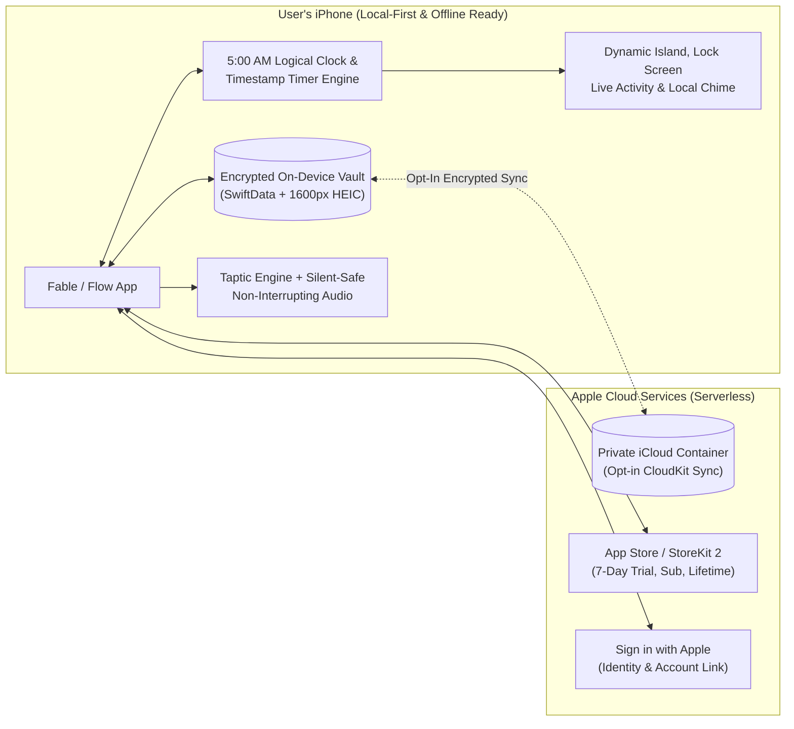
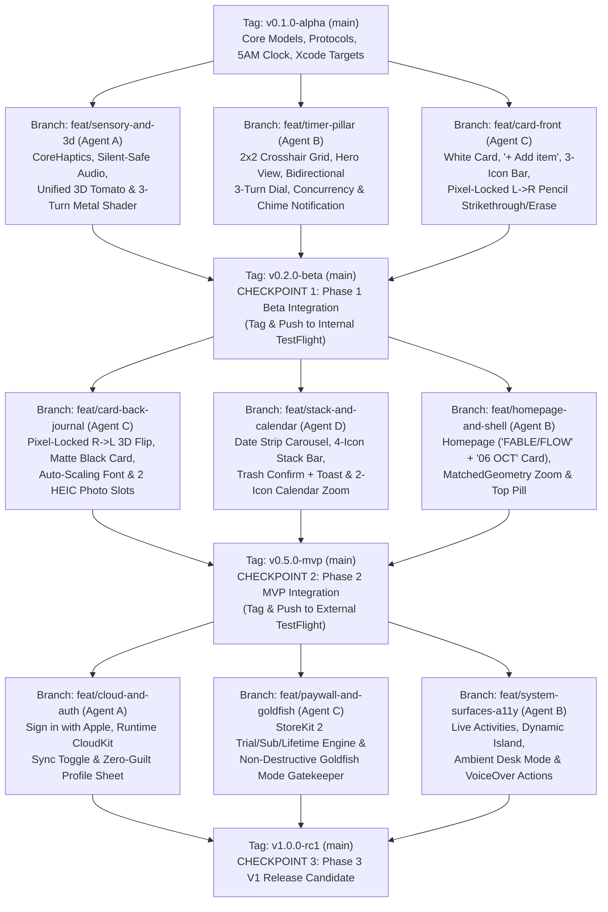

# Fable / Flow — Technical Implementation Plan & Evaluation Criteria

> **Note:** This document accompanies **Product Requirements Document (v4): Fable / Flow**. Every screen layout, icon bar count, and interaction rule in this plan is 100% synchronized with the UI Mockups and PRD v4.

## Part 1: Technical Plan Overview (Plain English)

### 1. The Big Components & How They Fit Together

Think of **Fable / Flow** as a **digital desk** containing two physical objects—an **Index Card** and a **3D Heirloom Tomato Timer**—powered by five modular building blocks that snap together cleanly:

```go
+-----------------------------------------------------------------------------------+
|                        1. THE WORKSPACE STAGE (User Interface)                    |
|   Minimalist Desk ('FABLE/FLOW' + '06 OCT')  |  Top Pill  |  Profile & Paywall    |
+-----------------------------------------+-----------------------------------------+
                                          |
                 +------------------------+------------------------+
                 |                                                 |
                 v                                                 v
+----------------------------------------+       +----------------------------------+
|     2. THE INDEX CARD ENGINE           |       |     3. THE TOMATO TIMER ENGINE   |
|  - Front: 6 Slots, '+ Add item',       |       |  - 2x2 Grid with Crosshairs      |
|    L->R Pixel Pencil Draw/Erase        |<----->|  - Hero View ('02:30' / '01/..') |
|  - Back: Auto-Font + 2 HEIC Photos     |Links  |  - Bidirectional 3-Turn Dial     |
|  - R->L 180° Card Flip + 3-Icon Bar    |Tasks  |  - Forward Stopwatch Mode        |
|  - Stack (4-Icon Bar + Trash Confirm)  |       |  - 4-Timer Concurrency & Chime   |
|  - Calendar Pinch-Zoom (2-Icon Bar)    |       |                                  |
+----------------------------------------+       +----------------------------------+
                 |                                                 |
                 +------------------------+------------------------+
                                          |
                                          v
+-----------------------------------------------------------------------------------+
|                 4. THE SENSORY ENGINE (Feel, Sound & 3D Shader)                   |
|   CoreHaptics Vibrations  |  Silent-Safe Mixed Audio  |  Adaptive-FPS 3D + Shader |
+-----------------------------------------------------------------------------------+
                                          |
                                          v
+-----------------------------------------------------------------------------------+
|               5. THE MEMORY VAULT & iOS BRIDGES (Storage & System)                |
|   5:00 AM Logical Clock  |  Encrypted Local Vault  |  iCloud Sync  |  Lock Screen |
+-----------------------------------------------------------------------------------+
```

1. **The Workspace Stage (Navigation & Shell):** Displays the warm off-white desk surface (`#EAE8E1`). On the Home Page, it displays `'FABLE / FLOW'` at the top, the mini Card stamped `06 OCT`, and the 3D Tomato. Tapping either smoothly zooms in and switches the top header into the `Card | Timer` toggle pill.
2. **The Index Card Engine (Purpose & Presence):**
   - **Front (White Card):** Holds up to 6 flat tasks (`01` through `06`) with an inline `+ Add item` button and a 3-icon bottom bar (`[Stack]`, `[Flip]`, `[+]`). A pixel-direction math classifier separates **`Left → Right` finger drags** (`Δx > +15 px` inside a task row = draw or erase the textured graphite line) from **`Right → Left` swipes** (`Δx < -40 px` on the card = flip `180°` in 3D space).
   - **Back (Matte Black Card):** Provides an auto-shrinking text editor (scaling smoothly from `20pt` down to `13pt` before scrolling) and up to 2 photo frames that automatically compress camera photos down to lightweight `1600px` HEIC files.
   - **Archive (Stack & Calendar):** Provides the chronological date strip (`OCT 01 02 03 04 (05) 06`), a 4-icon bottom bar (`[Return ↩]`, `[Zoom Out 🔍-]`, `[Flip]`, and `[Trash 🗑]`), permanent deletion confirmation with a pop-up notification banner, and a pinch-to-zoom Monthly Calendar view with a 2-icon bottom bar (`[Return ↩]`, `[Zoom In 🔍+]`).
3. **The Tomato Timer Engine (Flow & Engagement):**
   - **4-Tomato `2×2` Grid:** Shows 4 heirloom tomatoes separated by thin crosshairs. Unassigned tomatoes are matte gray (`Tap to assign`); assigning a task via the dropdown turns that tomato into its quadrant's signature red shade and reveals its `Play ▶ / Pause ||` and `End ■` buttons. Up to 4 timers can hold paused tasks at once, while only 1 ticks actively.
   - **Hero Tomato & Bidirectional 3-Turn Odometer:** Tapping a tomato (or the small tomato on a card task row) opens the Hero View with its 4-icon bottom bar (`[2×2 Grid]`, `[Play/Pause]`, `[End]`, `[Stopwatch]`). Dragging **`Right → Left`** winds the timer up in 5-minute (`30°`) notches across up to 3 rotations (`180 mins`); dragging **`Left → Right`** unwinds it. A custom Metal shader updates the numbers painted on the tomato's equator (`0–60`, `65–120`, `125–180`) as it turns. Finishing or ending a timer plays a soft chime (even when locked) and resets the clock to `00:00` **without** crossing out the task on the Card.
4. **The Sensory Engine (Touch, Sound & Battery-Safe 3D):** Synchronizes `CoreHaptics` vibrations, low-latency foley audio (which respects the hardware Silent switch and never interrupts background music), and the unified 3D renderer (`0 fps` when untouched, `15 fps` when ticking, `60–120 fps` when dragged).
5. **The Memory Vault & iOS Bridges:** Stores everything in an encrypted local database (`completeUntilFirstUserAuthentication`), computes the **5:00 AM Logical Day** (`currentTime - 5 hours`) so no background server is needed, syncs via Apple's iCloud when opted in, drives Lock Screen Live Activities and the Dynamic Island, and manages the 7-day trial, subscriptions/lifetime unlock, and non-destructive "Goldfish Mode" fallback.

### 2. How the Feature Fits in the Apple Ecosystem

Fable / Flow operates with **zero custom backend servers**. Every feature maps natively to Apple's built-in frameworks:



### 3. Feature Milestones & Versioning Roadmap

| Milestone & Version | Name | What Works at This Checkpoint |
| :--- | :--- | :--- |
| **Milestone 0 (`v0.1.0-alpha`)** | **Foundation & Contracts** | Project skeleton, encrypted local database, the 5:00 AM logical clock, data models, and shared interfaces so multiple engineers/agents can build components in parallel without colliding. |
| **Milestone 1 (`v0.2.0-beta`)** | **Core Tactile Loop (Beta)** | **Front of Today's Card** (6 tasks, `+ Add item`, 3-icon bottom bar, tap-to-edit, `Left → Right` graphite pencil cross/erase, task-row tomato link) + **4-Pomodoro Grid & Big Hero Tomato** (4 red shades vs. gray, bidirectional 180-min 3-turn odometer dial, Stopwatch mode, 1-active-timer rule, background completion chime) + **Full Haptics & Audio**. |
| **Milestone 2 (`v0.5.0-mvp`)** | **Complete Daily Ritual & Archive (MVP)** | **Minimalist 2-Object Homepage** (`FABLE / FLOW` + `06 OCT` mini-card) + **Global Top Pill** + **Matte Black Card Back** (`Right → Left` 3D 180° flip, auto-shrinking journal font down to `13pt` floor with scroll fallback, 1–2 compressed `1600px` HEIC photo slots) + **5:00 AM Automatic Rollover** + **Card Stack Viewer** (4-icon bar, permanent Trash delete confirmation + pop-up notification) + **Pinch-to-Zoom Monthly Calendar** (2-icon bar). |
| **Milestone 3 (`v1.0.0-rc1`)** | **V1 Launch: Cloud, Paywall & iOS Surfaces** | **Profile Modal** (Sign in with Apple, opt-in iCloud Sync, zero analytics) + **Hybrid Paywall** (7-Day Trial, Monthly, Annual, Lifetime, and non-destructive "Goldfish Mode" fallback) + **Live Activities, Dynamic Island, Lock Screen Widgets, Ambient Desk Mode**, and full VoiceOver Accessibility. |

### 4. How to Deploy the Project

1. **Continuous Integration (Xcode Cloud / GitHub Actions):** Automated build and unit/UI test suite execution on every branch merge into `main`.
2. **Apple Developer & App Store Connect Setup:**
   - Register App ID `com.fableflow.app` and Widget Extension `com.fableflow.app.widgets`, shared App Group `group.com.fableflow.shared`, iCloud Container `iCloud.com.fableflow.app`, and Sign in with Apple.
   - Configure StoreKit 2 products in App Store Connect: Monthly Subscription (`com.fableflow.sub.monthly` with 7-day free trial), Annual Subscription (`com.fableflow.sub.annual` with 7-day free trial), and Lifetime Unlock (`com.fableflow.unlock.lifetime`).
3. **Phased Rollout:**
   - **Phase 1 (`v0.2.0-beta`) → Internal TestFlight:** Hardware validation of CoreHaptics, Silent Mode switch behavior, background music mixing, and 3-turn odometer shader on physical iPhones.
   - **Phase 2 (`v0.5.0-mvp`) → External TestFlight:** Multi-day testing across the 5:00 AM boundary, retroactive Stack editing, permanent Trash deletion, and HEIC photo storage size.
   - **Phase 3 (`v1.0.0-rc1`) → App Store Release:** Submit for App Store Review with 7-day Phased Release enabled.

## Part 2: Detailed Implementation Plan

### 1. Multi-Branch, Multi-Agent Parallel Execution Architecture

Once **Milestone 0 (`v0.1.0-alpha`)** is committed to `main`, **4 parallel coding agents** work simultaneously on isolated feature branches. Using Xcode 16 synchronized folder groups (`PBXFileSystemSynchronizedRootGroup`) and protocol boundaries (`ServiceProtocols.swift`) ensures agents never edit the same file or clash on `project.pbxproj`.



### 2. Exhaustive File-by-File Codebase Manifest & Rationale

#### Milestone 0 (`v0.1.0-alpha`): Foundation, Data Models & 5:00 AM Clock
**Branch:** `chore/project-foundation`

| File Path | Rationale & Exact Implementation Rules |
| :--- | :--- |
| `FableFlow.xcodeproj/project.pbxproj` | Configures `FableFlow` (main app), `FableFlowWidgetsExtension` (Live Activities / Dynamic Island), `FableFlowTests`, and `FableFlowUITests` using synchronized root groups so parallel agents can create files without merge conflicts. |
| `FableFlow/App/FableFlowApp.swift` | `@main` entry point. Initializes `PersistenceContainer`, `LogicalDayService`, `SensoryEngine`, `TimerCoordinator`, `ToastNotificationCenter`, and `EntitlementManager`. Reconciles wall-clock timers and checks the 5:00 AM day rollover on `.active` scene phase transitions. |
| `FableFlow/App/FableFlow.entitlements` | Declares App Group `group.com.fableflow.shared`, Sign in with Apple, iCloud (`CloudKit` container `iCloud.com.fableflow.app`), and Data Protection `NSFileProtectionCompleteUntilFirstUserAuthentication`. |
| `FableFlow/App/Info.plist` | Declares `NSSupportsLiveActivities = YES`, `NSPhotoLibraryUsageDescription` (for back-of-card photos), and custom typography fonts. |
| `FableFlow/Config/FableFlowProducts.storekit` | StoreKit 2 test configuration defining `com.fableflow.sub.monthly` (7-day free trial), `com.fableflow.sub.annual` (7-day free trial), and `com.fableflow.unlock.lifetime` (`"Buy Your Physical Tools Once"`). |
| `FableFlow/Core/DesignSystem/ThemeTokens.swift` | Defines all mockup color constants and typography: Warm Off-White Canvas (`#EAE8E1`), Crisp Card White (`#FAF9F5`), Matte Journal Black (`#141413`), Unassigned Tomato Matte Gray (`#8E8D8A`), Quadrant 1 Deep Crimson (`#8B1E24`), Quadrant 2 Warm Terracotta (`#C84B31`), Quadrant 3 Rich Dark Burgundy (`#5E192A`), and Quadrant 4 Sun-Ripened Coral (`#D96B52`). |
| `FableFlow/Core/DesignSystem/InAppToastBannerView.swift` | Floating notification banner manager (`ToastNotificationCenter`) that pops up confirmation notifications (such as `"Card for Monday, Oct 05 permanently deleted"` when a user confirms Trash Can deletion in the Stack Viewer). |
| `FableFlow/Core/Time/LogicalDayService.swift` | Implements the **5:00 AM Daily Boundary** (`Calendar.autoupdatingCurrent.date(byAdding: .hour, value: -5, to: now)`). Provides exact mockup date formatters: `miniCardDateStamp` (`"06 OCT"` for the Homepage mini-card, Mockup p. 11) and `fullCardDateStamp` (`"TUESDAY — OCT 06"` for expanded Front/Back cards, Mockup p. 13–14). Emits a live publisher tick at `05:00:00` local time so open desk sessions transition automatically. |
| `FableFlow/Core/Models/DailyCard.swift` | SwiftData `@Model` class with CloudKit-compliant default values (`logicalDateString: String = ""`, `createdAt: Date = .now`, `reflectionText: String = ""`, `@Relationship(deleteRule: .cascade) var tasks: [CardTask]? = []`, `@Relationship(deleteRule: .cascade) var photos: [JournalPhoto]? = []`). Using `.cascade` delete rules ensures that permanently deleting a card via the Trash Can (`🗑`) cleanly purges its tasks and HEIC photo blobs from storage. |
| `FableFlow/Core/Models/CardTask.swift` | SwiftData `@Model` representing one of the 6 flat task slots (`slotIndex: Int = 1`, `title: String = ""`, `isCompleted: Bool = false`, `strikethroughPointsData: Data? = nil`). Serializes the user's normalized `[CGPoint]` left-to-right finger path so their hand-drawn graphite line is preserved across launches. |
| `FableFlow/Core/Models/JournalPhoto.swift` | SwiftData `@Model` storing `slotIndex: Int = 0` (`0` or `1`), `@Attribute(.externalStorage) var heicData: Data? = nil`, and `createdAt: Date = .now`. |
| `FableFlow/Core/Models/TomatoTimerSlot.swift` | SwiftData `@Model` representing Quadrants `0...3` (`quadrantIndex: Int`, `assignedTaskID: UUID?`, `customTitle: String?`, `modeRawValue: String`, `runStateRawValue: String`, `configuredDurationSeconds: Int`, `targetEndDate: Date?`, `anchorStartDate: Date?`, `pausedRemainingOrElapsedSeconds: Double`). Wall-clock timestamps guarantee zero drift across backgrounding or device lock. |
| `FableFlow/Core/Persistence/PersistenceContainer.swift` | Manages the encrypted SwiftData store in `group.com.fableflow.shared` with `FileProtectionType.completeUntilFirstUserAuthentication`. Supports runtime switching between local-only storage (`cloudKitDatabase: .none`) and opt-in iCloud sync (`cloudKitDatabase: .private("iCloud.com.fableflow.app")`). |
| `FableFlow/Core/Media/HEICImageCompressor.swift` | Downsamples any picked image using `CGImageSourceCreateThumbnailAtIndex` to a max dimension of `1600px` and encodes to `HEIC` (`0.78` compression quality) before saving to `JournalPhoto`. |
| `FableFlow/Core/Protocols/ServiceProtocols.swift` | Defines `SensoryServiceProtocol`, `TimerCoordinatorProtocol`, `CardRepositoryProtocol`, and `EntitlementServiceProtocol` so parallel branches compile and run unit tests independently. |

#### Milestone 1 (`v0.2.0-beta` / Phase 1): Core Tactile Loop (Card Front + 4-Pomodoro Timer + Sensory Engine)

##### Track 1A — Branch: `feat/sensory-and-3d` (Agent A)

| File Path | Rationale & Exact Implementation Rules |
| :--- | :--- |
| `FableFlow/Core/Sensory/SensoryEngine.swift` | Central coordinator triggering synchronized `CoreHaptics` and `TactileAudioManager` cues for all 5 matrix interactions: Tomato Twist/Unwind `30°` notch click, `Left → Right` Graphite Pencil drag/erase, `Right → Left` 180° Card Flip, Stack Date Riffle tick, and Trash Can permanent delete cue. |
| `FableFlow/Core/Sensory/HapticPatternLibrary.swift` | Procedural `CHHapticPattern` generator: stepped `30°` mechanical clicks, sharp pencil-down transient + velocity-modulated continuous friction curve, mid-weight cardstock lift + soft landing thud, and crisp stack riffle ticks. Handles `CHHapticEngine` lifecycle across app background/foreground transitions. |
| `FableFlow/Core/Sensory/TactileAudioManager.swift` | Configures `AVAudioSession` with `.ambient` category and `[.mixWithOthers]` option. Guarantees the hardware Silent Mode switch mutes all sound effects while preserving `CoreHaptics`, and never pauses or ducks background Spotify/Apple Music/podcasts. Uses pre-buffered `AVAudioEngine` nodes for zero-lag playback. |
| `FableFlow/Resources/Audio/`<br>(`ratchet_notch.caf`, `escapement_tick.caf`, `soft_chime.caf`, `graphite_loop.caf`, `card_flip_whoosh.caf`, `card_riffle_tick.caf`, `card_trash_delete.caf`) | Low-latency `.caf` foley audio assets matching the physical materials. |
| `FableFlow/Core/Rendering3D/Tomato3DSceneView.swift` | Unified 3D tomato renderer (`HeirloomTomato.usdz`) with adaptive frame-rate throttling: `0 fps` when paused/idle, `15 fps` during slow real-time countdown/stopwatch ticking, and `60–120 fps` during active finger dragging. Supports centered text overlay (`MATH STUDY / 02:30` or `Tap to assign`) for the `2×2` Grid View (Mockup p. 12) and equatorial number rendering above the white `▲` pointer for the Hero View (Mockup p. 11). |
| `FableFlow/Core/Rendering3D/TomatoOdometerShader.metal` | Custom Metal surface shader rendering the equatorial tick marks and dynamic odometer numbers on the 3D tomato sphere. Computes the active rotation turn (`Turn 1: 0°–360° → 0–60`, `Turn 2: 360°–720° → 65–120`, `Turn 3: 720°–1080° → 125–180`) so numbers rolling into view from behind the sphere dynamically increment when winding (`Right → Left`) and decrement when unwinding (`Left → Right`), matching `130 140 150 160` in Mockup p. 11. |
| `FableFlow/Resources/Models3D/HeirloomTomato.usdz` | 3D heirloom tomato mesh with upper rotating crown/body, lower base with white `▲` pointer mark, and UV-mapped equatorial number band. |

##### Track 1B — Branch: `feat/timer-pillar` (Agent B)

| File Path | Rationale & Exact Implementation Rules |
| :--- | :--- |
| `FableFlow/Features/Timer/TimerCoordinator.swift` | `@Observable` state machine managing all 4 `TomatoTimerSlot` instances. Enforces: (1) **1 Active Timer Rule** (starting one automatically pauses any other running timer), (2) **Decoupled Task Completion** (reaching `00:00` or tapping `■` resets the timer to `00:00` without crossing off the task on the Card), and (3) **Clear-to-Gray** (erasing a tomato's title returns it to Matte Neutral Gray). |
| `FableFlow/Features/Timer/OdometerDialPhysics.swift` | Implements **Bidirectional 3-Turn Odometer Math**: dragging horizontally **`Right → Left` (`Δx < 0`)** winds the countdown up in `5-minute` (`30°`) notched steps up to `180 minutes` (`1080°` / 3 turns); dragging **`Left → Right` (`Δx > 0`)** unwinds/decrements the countdown in `5-minute` (`30°`) notched steps down to `00:00`. Snaps cleanly to the nearest `30°` notch on release and triggers `SensoryEngine` ratchet clicks on each `30°` boundary crossing. In **Stopwatch Mode**, advances angle forward by `+6°` (1 minute notch) per elapsed minute. |
| `FableFlow/Features/Timer/TimerCompletionNotificationScheduler.swift` | Schedules a local `UNUserNotificationCenter` notification with custom sound `soft_chime.caf` at `targetEndDate` whenever a Countdown timer is running, and cancels it on Pause (`||`) or End (`■`). Ensures the user hears the soft completion chime at `00:00` even when the app is backgrounded or the iPhone is locked (with zero red badges or guilt notifications). |
| `FableFlow/Features/Timer/FourTomatoGridView.swift` | Renders the `2×2` grid with subtle crosshair divider lines (Mockup p. 12). Unassigned quadrants show a Matte Gray tomato labeled `"Tap to assign"`. Assigned quadrants show their distinct Heirloom Red tomato overlaid with uppercase Task Title + Digital Clock (`MATH STUDY / 02:30`), and inline `[Play ▶ / Pause ||]` + `[End ■]` buttons directly beneath the tomato. |
| `FableFlow/Features/Timer/TaskAssignmentMenuView.swift` | Renders the dark floating dropdown menu directly over the tapped tomato (Mockup p. 12 bottom-left) with `+ Custom Title...` at the top and Today's Card tasks (`Pick Up Package`, etc.) in a selectable list below, plus an option to clear the title and return the tomato to gray. |
| `FableFlow/Features/Timer/SingleHeroTomatoView.swift` | Renders the zoomed-in Single Hero Tomato screen (Mockup p. 11 bottom): huge left-aligned digital readout (`02:30`), uppercase task subtitle (`01 / MATH STUDY`), large interactive 3D tomato with bidirectional horizontal drag gesture, and the 4-icon bottom control bar (`[2×2 Grid ⊞]`, `[Play ▶ / Pause ||]`, `[End ■]`, `[Stopwatch ⏱]`). |

##### Track 1C — Branch: `feat/card-front` (Agent C)

| File Path | Rationale & Exact Implementation Rules |
| :--- | :--- |
| `FableFlow/Features/Card/DailyCardRepository.swift` | Manages `DailyCard` persistence keyed by `LogicalDayService`. Enforces the strict 6-task maximum, flat task structure (no subtasks), zero rollover of yesterday's uncrossed tasks at 5:00 AM, and permanent deletion when requested from the Stack Viewer. |
| `FableFlow/Features/Card/CardGestureMath.swift` | Pure geometry/pixel math classifier enforcing the **Pixel-Direction Rules**:<br>- **`isLeftToRightPencilStroke(startPoint:currentPoint:inRowBounds:)`**: Returns `true` strictly when touch starts inside a task row's bounds and `Δx = currentPoint.x - startPoint.x > +15.0` pixels with `abs(Δy) <= Δx * tan(25° * .pi / 180)`.<br>- **`isRightToLeftCardFlip(startPoint:currentPoint:)`**: Returns `true` strictly when touch moves right-to-left with `Δx = currentPoint.x - startPoint.x < -40.0` pixels and `abs(Δy) <= abs(Δx) * tan(35° * .pi / 180)`.<br>Guarantees a `Left → Right` drag only ever crosses/uncrosses a task and a `Right → Left` drag only ever flips the card. |
| `FableFlow/Features/Card/CardFrontView.swift` | Renders the crisp white index card (Mockup p. 13 top): top-left **`TUESDAY — OCT 06`** header with horizontal divider rule, numbered task rows (`01`–`06`) with zero vertical scrolling, the muted **`+ Add item`** row when `< 6` tasks exist, and the **3-icon bottom bar** (`[Stack Icon]`, `[Flip Icon]`, `[+ Plus Icon]`). |
| `FableFlow/Features/Card/TaskRowView.swift` | Renders an individual task slot (`01 Math Study`) with tap-to-edit inline text entry, the right-aligned small 3D heirloom tomato icon (red when assigned to a timer, gray when unassigned; tapping opens `SingleHeroTomatoView` synced to that task), and the `PencilStrikethroughCanvas` overlay. |
| `FableFlow/Features/Card/PencilStrikethroughCanvas.swift` | Uses `CardGestureMath.isLeftToRightPencilStroke` to track the user's finger pixel-by-pixel from Left to Right (`Δx > +15 px`). On an uncrossed task, draws a live textured graphite pencil line following the finger path with velocity-modulated `CoreHaptics` and pencil-scratch audio; on an already crossed-out task, dragging Left to Right erases the graphite line cleanly. |

#### Milestone 2 (`v0.5.0-mvp` / Phase 2): Complete Daily Ritual, Card Back, Homepage & Archive

##### Track 2A — Branch: `feat/card-back-journal` (Agent C)

| File Path | Rationale & Exact Implementation Rules |
| :--- | :--- |
| `FableFlow/Features/Card/CardFlipContainerView.swift` | Hosts `CardFrontView` and `CardBackJournalView` inside a 3D `180°` Y-axis rotation container. Triggered either by `CardGestureMath.isRightToLeftCardFlip` (`Right → Left` swipe, `Δx < -40 px`) or by tapping the bottom-center `[Flip Icon]`, firing `SensoryEngine.playCardFlip()`. |
| `FableFlow/Features/Card/CardBackJournalView.swift` | Renders the Matte Black reverse side (Mockup p. 13 bottom): top-left white **`TUESDAY — OCT 06`** header with subtle divider rule, `AdaptiveJournalTextEditor` in clean white typography, `JournalPhotoSlotsView` (up to 2 framed photos at the bottom), and the **3-icon bottom bar** (`[Stack Icon]`, `[Flip Icon]`, `[+ Plus Icon]`). Strictly 100% user-authored text with zero AI rewriting. |
| `FableFlow/Features/Card/AdaptiveJournalTextEditor.swift` | Dynamically measures reflection text inside the available card height and scales the font size down from `20pt` to the **`13pt` minimum floor** so longer reflections fit comfortably inside the black card frame. Once text at `13pt` exceeds the frame height, locks font size at `13pt` and enables vertical scrolling. |
| `FableFlow/Features/Card/JournalPhotoSlotsView.swift` | Displays compact `[+ Photo]` square buttons when 0 or 1 photo is attached, or up to 2 side-by-side framed photos at the bottom of the black card (Mockup p. 13 bottom), compressing all picked photos via `HEICImageCompressor` (`≤ 1600px` HEIC). |

##### Track 2B — Branch: `feat/stack-and-calendar` (Agent D)

| File Path | Rationale & Exact Implementation Rules |
| :--- | :--- |
| `FableFlow/Features/Archive/CardStackViewer.swift` | Renders the Stack Detail screen (Mockup p. 14 top):<br>1. **Top Date Strip:** `OCT 01 02 03 04 (05) 06` with solid black circle on the selected date and riffle haptics/audio on scroll.<br>2. **Retroactive Card Carousel:** Center card with peeking neighbor card edges; full editing of front tasks, `Left → Right` pencil strikethrough/erase, `Right → Left` flip, and back journal/photos.<br>3. **4-Icon Bottom Bar:** Left `[Return ↩]`, Center-Left `[Zoom Out 🔍-]`, Center-Right `[Flip Icon]`, and Right **`[Trash Can 🗑]`**.<br>4. **Permanent Trash Deletion & Notification Flow:** Tapping `[Trash Can 🗑]` presents a confirmation alert (`"Permanently delete this card? This action cannot be undone."` with `"Delete Permanently"` destructive action). Confirming permanently deletes the `DailyCard` (and its cascaded tasks/photos) from `SwiftData`/`CloudKit`, fires `SensoryEngine` discard feedback, and triggers `InAppToastBannerView` (`"Card permanently deleted"`). |
| `FableFlow/Features/Archive/MonthlyCalendarZoomView.swift` | Renders the Calendar Zoom-Out screen (Mockup p. 14 bottom), entered via two-finger inward pinch (`MagnificationGesture`) or tapping `[Zoom Out 🔍-]`. Shows vertically stacked monthly grids (`SEPTEMBER 2026`, `OCTOBER 2026`) with soft gray circles on dates with cards and a solid black circle on the selected date, plus the **2-icon bottom bar**: Left `[Return ↩]` and Right `[Zoom In 🔍+]`. |

##### Track 2C — Branch: `feat/homepage-and-shell` (Agent B)

| File Path | Rationale & Exact Implementation Rules |
| :--- | :--- |
| `FableFlow/Features/Workspace/MinimalistHomepageView.swift` | Renders the Home Page (Mockup p. 11 top): warm off-white canvas (`#EAE8E1`), top mini white card stamped **`06 OCT`** in a subtle frame, and bottom 3D Heirloom Tomato. Uses `matchedGeometryEffect` to smoothly zoom into Today's Card or the `2×2` Tomato Grid. |
| `FableFlow/Features/Workspace/GlobalTopBarView.swift` | Displays centered `'FABLE / FLOW'` + top-right `[Profile Icon]` on the Homepage (Mockup p. 11 top), and morphs into the centered `Card | Timer` segmented pill + top-right `[Profile Icon]` inside all Card, Timer, Stack, and Calendar views (Mockups p. 11–14). |
| `FableFlow/Features/Workspace/WorkspaceRootView.swift` | Root navigation state machine coordinating transitions between Homepage, Card View, Timer View, and Stack/Calendar View, plus hosting the top-level `InAppToastBannerView` overlay and live 5:00 AM transition animation. |

#### Milestone 3 (`v1.0.0-rc1` / Phase 3): Cloud Sync, Monetization, System Surfaces & Accessibility

##### Track 3A — Branch: `feat/cloud-and-auth` (Agent A)

| File Path | Rationale & Exact Implementation Rules |
| :--- | :--- |
| `FableFlow/Features/Account/AuthAndSyncManager.swift` | Handles **Sign in with Apple** (`AuthenticationServices`) and toggles opt-in **CloudKit Sync** (`iCloud.com.fableflow.app`) via `PersistenceContainer` without requiring any custom backend server. |
| `FableFlow/Features/Account/ProfileSettingsSheetView.swift` | Minimal account sheet opened from the top-right `[Profile Icon]`. Contains Sign in with Apple / Sign Out, CloudKit Sync toggle, optional Running Escapement Tick Sound toggle, and Subscription Management / Restore Purchases. **Strictly zero analytics charts, focus hour counters, or streak graphs.** |

##### Track 3B — Branch: `feat/paywall-and-goldfish` (Agent C)

| File Path | Rationale & Exact Implementation Rules |
| :--- | :--- |
| `FableFlow/Features/Monetization/EntitlementManager.swift` | StoreKit 2 engine managing the automatic **7-Day Full-Access Trial** (tracked via Keychain first-install date + StoreKit introductory eligibility), Monthly Subscription, Annual Subscription, and Lifetime One-Time Purchase (`"Buy Your Physical Tools Once"`). |
| `FableFlow/Features/Monetization/GoldfishModeGatekeeper.swift` | Enforces post-trial **Goldfish Mode** (1 Daily Card Front + 1 Pomodoro Timer in Quadrant 1, resetting at 5:00 AM). Presents `PaywallSheetView` when an unsubscribed post-trial user taps Tomatoes #2–#4, flips the card to the Back Journal, or taps `[Stack Icon]`—while keeping all trial cards/photos safely preserved on-device. |
| `FableFlow/Features/Monetization/PaywallSheetView.swift` | Calm, zero-guilt Hybrid Paywall presenting Monthly, Annual, and Lifetime unlock tiers, Restore Purchases, and `"Continue in Free Daily Mode"`. |

##### Track 3C — Branch: `feat/system-surfaces-a11y` (Agent B)

| File Path | Rationale & Exact Implementation Rules |
| :--- | :--- |
| `FableFlow/Features/SystemSurfaces/AmbientDeskModeController.swift` | Keeps screen awake (`UIApplication.shared.isIdleTimerDisabled = true`) while a timer is actively running in the foreground so the 3D tomato slowly rotates in real time on a desk stand. |
| `FableFlow/Features/SystemSurfaces/LiveActivityBridge.swift` | Projects active Countdown or Stopwatch state to iOS `ActivityKit` Live Activities and the Dynamic Island when backgrounded or locked. |
| `FableFlowWidgets/FableFlowWidgetsBundle.swift` | Widget extension entry point registering Lock Screen widgets and `TimerLiveActivityView`. |
| `FableFlowWidgets/TimerActivityAttributes.swift` | Shared `ActivityAttributes` struct between main app and widget extension. |
| `FableFlowWidgets/TimerLiveActivityView.swift` | Renders the Lock Screen banner and Dynamic Island (Compact Leading heirloom tomato in its quadrant red shade, Compact Trailing live countdown/stopwatch clock, and Expanded task view). |
| `FableFlow/Core/Accessibility/AccessibilityHelpers.swift` | Implements full VoiceOver support: `.accessibilityAdjustableAction` on the Hero Tomato (swipe up/down to wind/unwind in 5-min steps), single-tap `UIAccessibilityCustomAction` on task rows (`"Cross out task"` / `"Erase strikethrough"`), single-tap Card Flip action, Dynamic Type support, and High-Contrast borders. |

##### Automated Test Suite (`FableFlowTests/` & `FableFlowUITests/`)

| File Path | Rationale & Exact Implementation Rules |
| :--- | :--- |
| `FableFlowTests/LogicalDayServiceTests.swift` | Verifies 5:00 AM rollover boundary (`04:59:59` vs `05:00:00`), `06 OCT` vs `TUESDAY — OCT 06` date stamps, DST shifts, and zero unfinished task rollover. |
| `FableFlowTests/CardGestureMathTests.swift` | Unit-tests the pixel rules: proves `Δx = +20 px, Δy = 3 px` in a task row triggers `Left → Right` Strikethrough/Erase and **never** Card Flip, while `Δx = -50 px, Δy = 5 px` triggers `Right → Left` Card Flip and **never** Strikethrough. |
| `FableFlowTests/OdometerDialPhysicsTests.swift` | Verifies bidirectional 3-turn dial math (`Right → Left` winds up in `30°`/5m steps to `180m`; `Left → Right` unwinds in `30°`/5m steps to `0m`; Turn 1/2/3 shader offsets `0–60`, `65–120`, `125–180`). |
| `FableFlowTests/TimerCoordinatorConcurrencyTests.swift` | Verifies 4-timer concurrency (starting #2 pauses #1), decoupled task completion (`■` or `00:00` never crosses out the card task), background notification scheduling at `targetEndDate`, and unassign-to-gray reset. |
| `FableFlowTests/HEICImageCompressorTests.swift` | Verifies 12MP images compress to `≤ 1600px` HEIC `< 500KB`. |
| `FableFlowTests/StackPermanentDeleteTests.swift` | Verifies that confirming Trash Can (`🗑`) deletion permanently removes the `DailyCard`, its `CardTask` children, and its `JournalPhoto` blobs from `SwiftData` and triggers the deletion notification banner. |
| `FableFlowUITests/DailyRitualEndToEndUITests.swift` | End-to-end XCUITest verifying the full Section 4 user journey and all mockup button counts across every screen. |

## Part 3: Evaluation Criteria (Skeptical Fact-Checker Verification Protocol)

### Layer 1: The 30-Second Automated Terminal Audit (Run Before Opening the App)

Run these 7 commands in Terminal from the root of the delivered repository:

```bash
# 1. Verify NO midnight rollover bug (must use 5:00 AM offset, never standard isDateInToday)
grep -rn "isDateInToday" FableFlow/
# PASS CRITERIA: 0 matches.

# 2. Verify Pixel-Direction Math Rules exist for L->R Strikethrough vs R->L Flip
grep -rn "isLeftToRightPencilStroke" FableFlow/ && grep -rn "isRightToLeftCardFlip" FableFlow/
# PASS CRITERIA: Matches in CardGestureMath.swift and CardGestureMathTests.swift.

# 3. Verify Hardware Silent Switch & Background Music Protection (.ambient + .mixWithOthers)
grep -rn "\.ambient" FableFlow/ && grep -rn "mixWithOthers" FableFlow/
# PASS CRITERIA: Matches in TactileAudioManager.swift.

# 4. Verify 1600px HEIC Image Compression (Storage Bloat Protection)
grep -rn "1600" FableFlow/ && grep -rn "heic" FableFlow/
# PASS CRITERIA: Matches in HEICImageCompressor.swift.

# 5. Verify Encrypted Local Database (completeUntilFirstUserAuthentication)
grep -rn "completeUntilFirstUserAuthentication" FableFlow/
# PASS CRITERIA: Match in PersistenceContainer.swift or FableFlow.entitlements.

# 6. Verify 3-Turn Odometer Metal Shader exists (not a fake 2D image spin)
find FableFlow -name "*.metal"
# PASS CRITERIA: Outputs FableFlow/Core/Rendering3D/TomatoOdometerShader.metal.

# 7. Run the Full Automated Unit & UI Test Suite
xcodebuild test -scheme FableFlow -destination 'platform=iOS Simulator,name=iPhone 16 Pro'
# PASS CRITERIA: ** TEST SUCCEEDED ** with 0 failures across all 7 test files.
```

### Layer 2: The 12-Point Physical iPhone Torture Test

| # | Feature Under Audit | Exact Test to Run on Your iPhone | What Proves Thorough Work (PASS) | What Exposes a Shortcut (FAIL) |
| :- | :--- | :--- | :--- | :--- |
| **1** | **Mockup Visual & Icon Count Fidelity** | Inspect the bottom bars and headers of all 6 screens against Pages 11–14 of the PRD. | • **Homepage:** `'FABLE / FLOW'` + `[Profile]` at top; mini card stamped `06 OCT`.<br>• **Today's Card (Front & Back):** **3 bottom icons** (`[Stack]`, `[Flip]`, `[+]`) + `+ Add item` row on Front.<br>• **Back of Card:** Clean `TUESDAY — OCT 06` header, white reflection text, 2 framed photos at bottom.<br>• **Stack Detail:** **4 bottom icons** (`[Return ↩]`, `[Zoom Out 🔍-]`, `[Flip]`, `[Trash 🗑]`).<br>• **Calendar View:** **2 bottom icons** (`[Return ↩]`, `[Zoom In 🔍+]`).<br>• **Hero Tomato:** **4 bottom icons** (`[2×2 Grid]`, `[Play/Pause]`, `[End]`, `[Stopwatch]`). | Any missing icon, wrong icon order, or mismatch with Mockups p. 11–14. |
| **2** | **Pixel Rule: `Left → Right` Strikethrough vs. `Right → Left` Flip** | On Today's Card Front, drag `Left → Right` (`Δx > +15 px`) across `02 Build Deck`. Drag `Left → Right` across it a second time. Then drag `Right → Left` (`Δx < -40 px`) across the card. | • 1st `Left → Right` drag: Textured graphite line follows finger pixel-by-pixel with scratch haptics/sound.<br>• 2nd `Left → Right` drag: Cleanly erases the graphite line.<br>• `Right → Left` drag: Never draws a pencil line; smoothly flips the card `180°` in 3D space to the Matte Black back side. | `Left → Right` drag flips the card, `Right → Left` drag crosses out a task, or strikethrough is just an instant static font line instead of tracking your finger. |
| **3** | **Bidirectional 3-Turn Odometer Shader (`0–180m`)** | In Hero Tomato view, drag `Right → Left` past Turn 1 (`60m`) and Turn 2 (`120m`) into Turn 3 (`150m` / readout `02:30`). Then drag `Left → Right` two notches back (`140m` / `02:20`). | • `12` distinct mechanical haptic clicks per `360°` turn (`30° = 5m`).<br>• On Turn 3, the painted numbers rolling around the **3D tomato sphere itself** read `130 140 150 160` above the white `▲` pointer.<br>• Dragging `Left → Right` smoothly unwinds the dial in 5-min steps. | Numbers on the 3D tomato stay `10 20 30 40` on Turn 2/3, or dragging `Left → Right` does not unwind the timer. |
| **4** | **Background Timer Chime & Lock Screen Accuracy** | Wind a tomato to `00:05` (or start a timer and wait until 30 seconds remain), tap `Play ▶`, and **lock your iPhone**. Wait for it to hit `00:00`. | • Dynamic Island / Lock Screen Live Activity counts down smoothly.<br>• At `00:00`, the **soft completion chime plays while locked**.<br>• Zero red badge numbers appear on the home screen app icon. | Timer freezes when screen locks, or no chime plays at `00:00` when backgrounded. |
| **5** | **Stopwatch Forward Rotation** | In Hero Tomato view, tap `[Stopwatch Toggle ⏱]` (resets to `00:00`) and tap `Play ▶`. Watch for 60 seconds. | Tomato physically rotates **forward** (opposite of countdown unwinding) by 1 minute notch per minute with subtle escapement ticks. | Tomato stays frozen or rotates backward in Stopwatch mode. |
| **6** | **4-Timer Concurrency & Decoupled Strikethrough** | Assign Task `01` to Tomato #1 and tap `Play ▶`. Go to the `2×2` Grid, assign Task `02` to Tomato #2, and tap `Play ▶` on Tomato #2. Then tap `End ■` on Tomato #2 and check the Card. | • Starting Tomato #2 automatically switches Tomato #1 to `Paused ||` at its current time.<br>• Ending Tomato #2 (`■`) resets it to `00:00` and **does NOT cross out Task `02` on the Card**.<br>• Clearing Tomato #2's title returns it from Terracotta Red to **Matte Gray** (`Tap to assign`). | Two timers tick at once, ending a timer crosses out the task on the Card, or clearing the title leaves the tomato red. |
| **7** | **Trash Can (`🗑`) Permanent Delete & Pop-Up Notification** | Create a card with tasks and a photo, open the Stack Viewer (`[Stack Icon]`), tap the bottom-right `[Trash Can 🗑]`, and confirm deletion. Then restart the app and check the Stack & Calendar. | • Tapping `🗑` shows a confirmation alert warning that deletion is permanent.<br>• Confirming pops up an in-app confirmation notification banner (`"Card permanently deleted"`).<br>• The card and its highlight dot are permanently gone from both the Stack and Calendar after app restart. | Tapping `🗑` deletes without confirmation, fails to show a pop-up confirmation notification, or the deleted card reappears on restart. |
| **8** | **The 5:00 AM Rollover & Zero Task Rollover Test** | Leave 1 task uncrossed on Today's Card. In iPhone `Settings → General → Date & Time`, set the clock to **4:58 AM** next day, check the app, then set the clock to **5:01 AM** and check the app. | • At **4:58 AM**: Still on the same card (night-owl reflection still open).<br>• At **5:01 AM**: Yesterday's card is filed in the Stack with its uncrossed task preserved as an honest snapshot; Today's new card is 100% blank (zero task rollover). | Card rolls over at 12:00 AM midnight, or yesterday's uncrossed task copies onto Today's new card. |
| **9** | **Silent Switch & Background Music Mixing** | Play music in Spotify/Apple Music. Flip the iPhone hardware Silent switch **ON**, open Fable / Flow, twist the tomato and draw a pencil line. Then flip Silent switch **OFF**. | • Background music **never pauses or ducks**.<br>• Silent ON: 0% speaker sound, 100% `CoreHaptics` vibrations.<br>• Silent OFF: subtle foley sounds mix softly under your music. | Music stops when touching the tomato, or sound effects play through the speaker when Silent Mode is ON. |
| **10** | **Back-of-Card Auto-Font Scaling & `1600px` HEIC Photos** | Flip to the Matte Black back of the card. Type 1 sentence, then keep typing 6 paragraphs. Attach 2 camera photos. | • Font starts large (`20pt`) and visibly shrinks as you type more text until hitting the `13pt` floor, then becomes scrollable.<br>• Attached photos are downsampled to `≤ 1600px` HEIC (`< 500KB` each). | Text stays one fixed size and overflows/clips, or raw 10MB camera photos bloat storage. |
| **11** | **Zero-Guilt & Zero-AI Purity** | Inspect the `[Profile Icon]` modal, the Card editors, and the Stack. | Zero streak counters, zero focus-hour trend graphs, zero red overdue badges, and zero AI writing/summarizing buttons anywhere. | Any analytics chart, streak number, or AI prompt appears. |
| **12** | **VoiceOver Single-Tap Alternatives** | Turn on iOS **VoiceOver** (`Triple-Click Side Button`). Focus a task row and swipe up/down for actions; focus the Hero Tomato and swipe up/down. | • Task row exposes single-tap custom actions: `"Cross out task"` / `"Erase strikethrough"` and `"Start Pomodoro timer"`.<br>• Hero Tomato adjusts time in 5-min increments via vertical swipes. | VoiceOver users are trapped because `Left → Right` drag or 3D dial twist has no accessibility action. |
