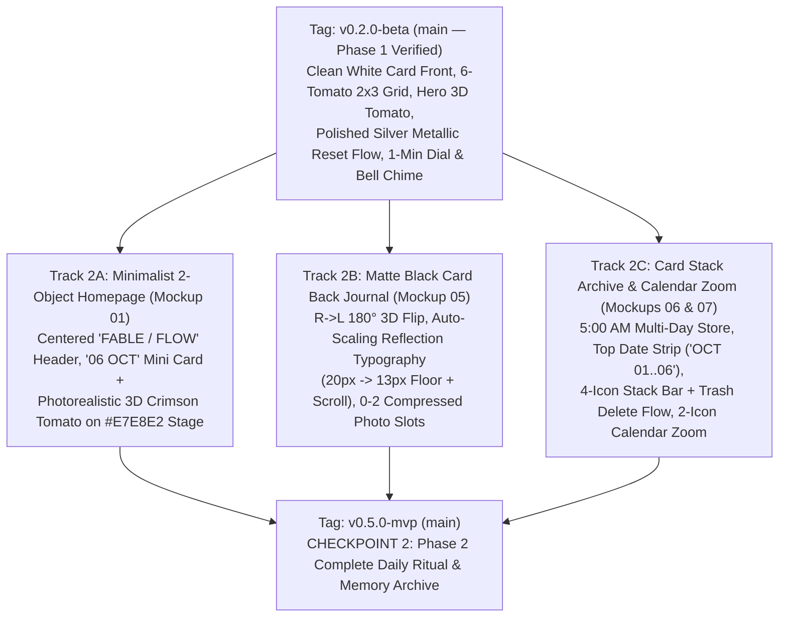

# Fable / Flow — Technical Implementation Plan & Evaluation Criteria (v4.2)

> **Note:** This document accompanies **Product Requirements Document (v4.2): Fable / Flow**. Every screen layout, visual preference, 3D rendering formula, metallic shader rule, and interaction flow established in Phase 1 (`v0.2.0-beta`) is codified here so **Phase 2 (`v0.5.0-mvp`)** and **Phase 3 (`v1.0.0-rc1`)** can be executed with zero ambiguity and zero regression.

---

## Part 1: Technical Plan Overview (Plain English)

### 1. The Big Components & How They Fit Together

Think of **Fable / Flow** as a **digital desk** containing two physical objects—an **Index Card** and a **3D Heirloom Tomato Timer**—powered by five modular building blocks that snap together cleanly:

```text
+-----------------------------------------------------------------------------------+
|                        1. THE WORKSPACE STAGE (User Interface)                    |
|   Minimalist Desk ('FABLE/FLOW' + '06 OCT')  |  Top Pill (Remembers Last View)    |
+-----------------------------------------+-----------------------------------------+
                                          |
                 +------------------------+------------------------+
                 |                                                 |
                 v                                                 v
+----------------------------------------+       +----------------------------------+
|     2. THE INDEX CARD ENGINE           |       |     3. THE TOMATO TIMER ENGINE   |
|  - Front: Clean White (No Dots),       |       |  - 6-Tomato 2x3 Grid (6 Colors)  |
|    6 Slots, Single 'Example Task',     |       |  - Hero View ('25:00'/'00:00:00')|
|    1-Tap Edit/Delete Modal (Resets     |<----->|  - 1-Min (3°) Dial + Tap-Digits  |
|    Tomato), Straight L->R Draw/Erase   |Links  |  - Inline Hero Subtitle Dropdown |
|  - Shiny 1-Highlight Mini-Tomatoes     |Tasks  |  - End (■) -> Polished Silver -> |
|    (Grey -> Hero; Lit -> Unassign)     |       |    Reset (↺) Two-Step Flow       |
|  - Back (Phase 2): Auto-Font + Photos  |       |  - Whole-Min Forward Stopwatch   |
|  - Stack & Calendar (Phase 2)          |       |  - Mechanical Dual-Bell Chime    |
+----------------------------------------+       +----------------------------------+
                 |                                                 |
                 +------------------------+------------------------+
                                          |
                                          v
+-----------------------------------------------------------------------------------+
|                 4. THE SENSORY & 3D RENDERING ENGINE                              |
|   Perspective 3D Surface Mesh  |  Polished Chrome Shader  |  Bell & Foley Audio   |
+-----------------------------------------------------------------------------------+
                                          |
                                          v
+-----------------------------------------------------------------------------------+
|               5. THE MEMORY VAULT & iOS BRIDGES (Storage & System)                |
|   5:00 AM Logical Clock  |  Encrypted Local Vault  |  iCloud Sync  |  Lock Screen |
+-----------------------------------------------------------------------------------+
```

1. **The Workspace Stage (Navigation & Shell):**
   - Displays the warm off-white desk surface (`#E7E8E2`).
   - The top `Card | Timer` segmented pill **remembers the user's last active Timer sub-view** (`Hero Tomato` or `6-Tomato Grid`) when toggling between `Card` and `Timer`.
2. **The Index Card Engine (Purpose & Presence):**
   - **Front (Clean White Card — Completed in Phase 1):**
     - Clean white surface (`#FDFDFB`) with **zero background dots**.
     - Starts with a single **`01 Example Task`** by default (no sample clutter).
     - Holds up to 6 flat tasks (`01` through `06`) with an inline `+ Add item` row and a 3-icon bottom bar (`[Stack]`, `[Flip]`, `[+]`).
     - **Single-Tap Edit & Delete Modal:** Clicking a task's text once opens the Edit Task Modal with a `Delete (🗑)` button; deleting a task automatically unassigns and resets its associated tomato back to grey.
     - **Straight Horizontal Left-to-Right Strikethrough & Erase:** Dragging `Left → Right` (`Δx > +15 px`) draws a straight horizontal graphite line; dragging `Left → Right` across a crossed-out task erases it from **Left to Right**.
     - **Shiny Single-Highlight Mini-Tomato Icons:** Clicking a **grey** mini-tomato assigns the task and immediately opens the **Hero Tomato** page; clicking a **lit (colored/silver)** mini-tomato on the Front Card unassigns it back to grey.
   - **Back (Matte Black Card — Phase 2):** Triggered by a `Right → Left` swipe (`Δx < -40 px`) or the center `[Flip]` button. Provides an auto-shrinking text editor (`20pt` down to `13pt` floor before scrolling) and up to 2 compressed photo slots.
   - **Archive (Stack & Calendar — Phase 2):** Chronological date strip (`OCT 01 02 03 04 (05) 06`), 4-icon bottom bar (`[Return ↩]`, `[Zoom Out 🔍-]`, `[Flip]`, `[Trash 🗑]`), permanent deletion confirmation with pop-up notification banner, and pinch-to-zoom Monthly Calendar view (`[Return ↩]`, `[Zoom In 🔍+]`).
3. **The Tomato Timer Engine (Flow & Engagement — Completed in Phase 1):**
   - **6-Tomato `2×3` Grid:** Displays 6 studio-lit heirloom tomatoes corresponding to the 6 daily task slots. Clicking any **assigned (colored or silver) tomato** on the Grid opens the **Hero Tomato View** (never unassigns on the Grid). Clicking an **unassigned grey tomato** (`Tap to assign`, centered at `top: 52%`) opens a task dropdown that **excludes any task already assigned to another tomato**.
   - **Hero Tomato, 1-Minute Dial, Tap-Digits Entry & Inline Reassignment:**
     - Supports both **1-minute (`3°`) bidirectional dial twisting** (`0–180m`) and **tapping the digital readout (`#hero-readout`)** to type minutes (`0–180`) or `HH:MM` (`02:30`) or pick a preset (`15m..180m`).
     - Displays `MM:SS` for `≤ 60m` and automatically switches to **`HH:MM:SS` (`00:00:00`)** for `> 60m`.
     - Tapping the task subtitle (`#hero-subtitle`) opens an inline dropdown right on the Hero page to assign, switch, custom-title, or unassign the task.
   - **Two-Step End (`■`) → Mirror-Polished Silver Metallic → Reset (`↺`) Flow:**
     - When a countdown finishes (`00:00`) or the user clicks `End (■)`, the tomato smoothly transitions into a **Mirror-Polished Chrome Silver Metallic** tomato (`isCompleted = true`) and the `End (■)` button becomes a **`Reset (↺)`** button. Clicking `Reset (↺)` restores the tomato's Heirloom Red shade and resets the clock to `lastConfiguredSeconds`.
4. **The Sensory & 3D Rendering Engine (Completed in Phase 1):**
   - **Photorealistic Studio Sprites & Polished Metallic Shader (`scripts/extract_mockup_assets.py`):** Extracts clean studio tomatoes with feathered `#E7E8E2` shadows, generates the Mirror-Polished Chrome Silver Metallic sprites (`hero-tomato-silver.png`, `grid-tomato-silver.png`) with natural sub-pixel $\alpha(x,y)$ anti-aliased edges, $C^\infty$ paraboloid-dome normals, 3-pass bilateral crown preservation, and one luminous upper-left studio highlight, plus glossy single-highlight mini-tomato icons (`mini-tomato-*.png`).
   - **True 3D Equatorial Surface Mesh (`js/tomato3D.js`):** Projects the 2x Retina odometer ribbon (`0–180m`) onto the tomato equator using perspective-camera horizon mapping ($\sin\theta_{\text{persp}} = 0.968 u$), upper-dome latitude relaxation, and bounded meridian tilt outside $\arcsin$.
   - **Mechanical Dual-Bell Pomodoro Chime (`js/sensoryEngine.js`):** Synthesizes an authentic spring-driven twin-bell striker roll with brass overtones and acoustic body resonance.

---

## Part 2: Codified Phase 1 Technical Specifications (Locked Baseline for Phase 2)

To guarantee that Phase 2 never regresses any Phase 1 visual or behavioral fix, the following technical rules are locked:

### 1. Photorealistic Asset & Metallic Shader Pipeline (`scripts/extract_mockup_assets.py`)

| Asset / Function | Locked Technical Specification |
| :--- | :--- |
| **Background Feathering (`feather_background_to_canvas_bg`)** | Hero crops (`700×600`, `x=54..754, y=536..1136`) and Grid crops (`324×300`) feather outer margins into exact `#E7E8E2` (`(231, 232, 226)`) so no rectangular sprite boundary is ever visible. |
| **Clean Equatorial Band (`smooth_hero_center_opening_and_edges`)** | Removes painted mockup numbers (`130..170`) via Neumann-boundary Laplace inpainting + centered median smoothing (`34th–64th` percentile + micro-grain) along $y_{\text{seam}}(x)$ while keeping the left/right outer silhouette edges 100% untouched. |
| **Mirror-Polished Silver Metallic (`recolor_silver_metallic`)** | 1. **Sub-Pixel Studio Edge Opacity:** Computes local interior redness $M(x,y) = \max_{9\times 9}(r - \max(g,b))$ and foreground opacity $\alpha(x,y) = \operatorname{clamp}\!\left(\frac{rg - 4.5}{\max(18, 0.78 M) - 4.5}\right)$, compositing metallic RGB directly over the local neutral background (`bg_rgb_grid`). Eliminates dark border rings, pink halos, and shadow speckles.<br>2. **Smooth 3D Cheeks + Crisp Calyx Leaves:** Uses a $C^\infty$ paraboloid-dome normal $\vec{N} = \frac{(-0.92 bx, -0.92 by, 1)}{\sqrt{1 + 0.85(bx^2 + by^2)}}$ (never clamping at $r=1$, eliminating bottom-right crescent ridges) blended with 10-pass seam-aware smoothing on the body and a 3-pass edge-preserving bilateral filter inside a smooth 2D elliptical crown mask ($d_{\text{calyx}}$) so 3D stem & calyx leaf ridges remain sharp.<br>3. **Single Luminous Softbox Highlight:** Adds one high-gloss studio specular reflection on the upper-left cheek (`bx = -0.32, by = -0.28`). |
| **Shiny Single-Highlight Mini-Tomatoes (`render_shiny_mini_tomato`)** | Renders all `58×58` mini-tomatoes (`mini-tomato-0..5.png`, `mini-tomato-silver.png`, `mini-tomato-grey.png`) from the artifact-free `mini_grey` silhouette template using $C^\infty$ dome shading and **one** crisp upper-left specular highlight (zero horizontal strips, zero pink edge halo). |

### 2. Hero Tomato 3D Surface Mesh Projection (`js/tomato3D.js`)

- **Equatorial Seam Polynomial (`getTomatoSeamY`):**
  $$u = \operatorname{clamp}_{[-1, 1]}\!\left(\frac{lx - 250.5}{215.5}\right), \quad y_{\text{seam}}(u) = 258.8 + 0.5 u - 18.2 u^2 - 15.2 u^4$$
- **Perspective-Camera Horizon Mapping & Edge Number Rendering (`_buildTomato3DMesh`):**
  - Band bounds: `bandX0 = 32`, `bandW1x = 438` (`lx = 32..470`), `cx = 250.5`, `R_eq = 215.5`.
  - Horizon mapping: $\sin\theta_{\text{persp}} = 0.968 u$, $\cos\theta_{\text{persp}} = \sqrt{\max(0.06, 1 - \sin^2\theta_{\text{persp}})}$, $\theta_{\text{base}} = \arcsin(\sin\theta_{\text{persp}}) \cdot \frac{180}{\pi} \cdot 1.0805$.
  - Upper-dome latitude relaxation: $y_{\text{lat}} = y_{\text{seam}} + 8.6 \, s_{\text{lat}}(v_{\text{raw}}) \, u^4$ so the number baseline follows the smooth upper-dome ellipse without plunging at $|u| > 0.85$.
  - Bounded meridian tilt outside $\arcsin$: $\theta_{\text{deg}} = \theta_{\text{base}} - 1.45 \, u \cdot \frac{v - 5.0}{35.0}$, preventing infinite-derivative parallelogram shearing or diagonal top-clipping at the visual curve edge.

### 3. Locked QA & PM Behavioral Rules (`js/app.js`, `js/odometerPhysics.js`, `js/sensoryEngine.js`)

| Rule ID | Component | Locked Implementation Behavior |
| :--- | :--- | :--- |
| **QA #1** | Zero-Second Countdown Guard | Pressing `Play (▶)` when a countdown is at `00:00` is blocked with a toast prompt (`"Wind the tomato or tap the digits to set a duration before starting"`). |
| **QA #2** | `HH:MM:SS` (`00:00:00`) Above 60m | `formatClock(seconds)` returns `HH:MM:SS` whenever `totalSec > 3600` (`> 60 minutes`) and toggles `.is-hhmmss` typography sizing on Hero (`50px`) and Grid (`13.5px`). |
| **QA #3** | Stopwatch Resume Safety | Tapping `[Stopwatch ⏱]` when already in Stopwatch mode toggles Play/Pause without wiping elapsed time to `00:00`. |
| **QA #4** | Task Delete Resets Tomato | Deleting a task from Today's Card automatically clears any timer slot assigned to that task (`assignedTaskSlot = null`, `isCompleted = false`, `remainingSeconds = 25 * 60`). |
| **QA #5** | Completed Silver Play Lock & Reset | In `isCompleted = true` (Silver Metallic), `Play (▶)` is disabled (`opacity: 0.28`), `End (■)` becomes `Reset (↺)`, and clicking `Reset (↺)` restores `lastConfiguredSeconds` and active red color. |
| **QA #6** | 1-Minute Dial Resolution | `MINUTES_PER_NOTCH = 1` (`DEGREES_PER_NOTCH = 3°`, `MAX_MINUTES = 180`, `MAX_DEGREES = 540°`). |
| **QA #7** | Mode-Switch Confirmation | Switching from Countdown to Stopwatch while a countdown is running or paused with progress prompts confirmation before discarding progress. |
| **PM #1** | Single-Tap Task Edit & Delete | Single-clicking a task's text on Today's Card Front opens the Edit Task Modal containing `Delete (🗑)`, `Cancel`, and `Save`. |
| **PM #2** | Top Pill Sub-View Memory | `this.lastTimerScreen` (`'grid'` or `'hero'`) is remembered so clicking `Timer` in the top pill returns to the user's last active Timer sub-view. |
| **PM #4** | Hero Subtitle Task Dropdown | Clicking `#hero-subtitle` on the Hero Tomato page opens `#hero-subtitle-dropdown-mount` in place to assign, switch, custom-title, or unassign tasks directly on the Hero screen. |

---

## Part 3: Phase 2 (`v0.5.0-mvp`) Detailed Implementation Plan

With Phase 1 (`v0.2.0-beta`) complete and verified (`16/16` checks passing), **Phase 2 (`v0.5.0-mvp` — Complete Daily Ritual & Memory Archive)** builds the remaining screens from the PRD Mockups (`01-home-page.png`, `05-card-back.png`, `06-stack-detail.png`, `07-calendar-view.png`) directly on top of the Phase 1 baseline:

### 1. Phase 2 Feature Tracks & Architecture



### 2. Phase 2 File-by-File Implementation Specification

#### Track 2A — Minimalist 2-Object Homepage (`01-home-page.png`)

| File / Module | Exact Implementation Rules for Phase 2 |
| :--- | :--- |
| `index.html` (`#screen-home`) & `css/style.css` | Adds the Minimalist Homepage view (`01-home-page.png`):<br>- **Top Header:** Centered `'FABLE / FLOW'` title (morphs smoothly into the `Card \| Timer` segmented pill when entering Card, Timer, Stack, or Calendar views) + top-right `[Profile Icon]`.<br>- **Top Object — The Daily Mini-Card:** Clean white horizontal cardstock (`#FDFDFB`, zero dots) resting in a subtle recessed desk frame, stamped in the top-left with **`06 OCT`** (`DD MMM` uppercase from `LogicalDayService`). Tapping zooms smoothly into Today's Card Front.<br>- **Bottom Object — The 3D Heirloom Tomato:** Uses the exact photorealistic `hero-tomato-0.png` studio render with equatorial odometer markings and white `▲` pointer resting on the `#E7E8E2` canvas with zero border lines. Tapping zooms into the Timer View. |

#### Track 2B — Matte Black Card Back Evening Journal (`05-card-back.png`)

| File / Module | Exact Implementation Rules for Phase 2 |
| :--- | :--- |
| `index.html` (`.card-face-back`) & `js/app.js` | Upgrades the `180°` 3D flipped back face of the card to the full **Matte Black Evening Reflection Journal** (`#141413` background, `#FAF9F5` text, Mockup `05-card-back.png`):<br>- **Top-Left Date Header:** Stamped with `TUESDAY — OCT 06` above a subtle horizontal divider rule.<br>- **Adaptive Typography Reflection Editor:** 100% user-authored freeform text area (zero AI rewriting). Automatically scales font size from `20px` down to a **`13px` minimum floor** as text length increases so reflections fit the card frame; once text at `13px` exceeds the available height, locks at `13px` and enables vertical scrolling.<br>- **Dual Framed Photo Slots (`0` to `2` Photos):** Displays up to 2 side-by-side framed photos at the bottom of the matte black card (or compact `[+ Photo]` triggers / bottom-right `[+]` button when fewer than 2 photos are attached). Client-side canvas compression downscales uploaded images to `≤ 1600px` JPEG/WebP (`< 400KB`) before persisting.<br>- **3-Icon Bottom Bar:** Preserves the exact `[Stack]`, `[Flip]`, `[+]` bottom bar (where `[Flip]` or a `Right → Left` swipe flips `180°` back to the White Front, and `[+]` attaches a photo or focuses the journal editor). |

#### Track 2C — Chronological Card Stack Archive, 5:00 AM Rollover & Monthly Calendar Zoom (`06-stack-detail.png` & `07-calendar-view.png`)

| File / Module | Exact Implementation Rules for Phase 2 |
| :--- | :--- |
| `js/app.js` (`DailyCardArchiveStore` & `LogicalDayService`) | Implements multi-day chronological card storage keyed by the **5:00 AM Logical Day** (`currentTime - 5 hours`):<br>- Automatically archives yesterday's card into the Stack at `05:00:00 AM` local time and creates a fresh white card for the new day with **zero unfinished task rollover**.<br>- Supports full **retroactive editing** of any archived card in the Stack (editing front tasks, drawing/erasing `Left → Right` strikethroughs, flipping `180°` to the Matte Black back to edit reflection text or add/remove photos). |
| `index.html` (`#screen-stack`) & `css/style.css` | Implements the **Card Stack Detail View** (`06-stack-detail.png`):<br>- **Top Chronological Date Strip:** Horizontal scrollable strip (`OCT 01   02   03   04   (05)   06`) with a solid black pill/circle highlighting the active date (`05`) and tactile riffle ticks (`SensoryEngine.playStackRiffleTick()`) when switching dates.<br>- **Center Peeking Card Carousel:** Displays the selected date's card (Front or Back) in center stage with subtle peeking edges of adjacent archived cards on the left and right.<br>- **4-Icon Stack Bottom Bar:**<br>  1. Left `[Return / Undo Arrow ↩]`: Immediately returns to Today's current card.<br>  2. Center-Left `[Zoom Out Magnifying Glass 🔍-]`: Zooms out to the Monthly Calendar View (also triggered by two-finger pinch-in).<br>  3. Center-Right `[Flip Icon]`: Flips the selected archived card `180°` between Front and Back.<br>  4. Right `[Trash Can 🗑]`: Opens the permanent delete confirmation modal (*"Permanently delete this card? This action cannot be undone."*). Confirming permanently deletes that date's card from storage, plays the discard audio/haptic cue, and displays the top confirmation notification banner (*"Card permanently deleted"*). |
| `index.html` (`#screen-calendar`) & `css/style.css` | Implements the **Monthly Calendar Zoom-Out View** (`07-calendar-view.png`):<br>- Displays vertically stacked monthly calendar grids (`SEPTEMBER 2026`, `OCTOBER 2026`) with soft grey circles on dates that contain archived cards and a solid black circle on the currently selected date.<br>- Tapping any date with a card selects it and zooms into that card in the Stack Detail View.<br>- **2-Icon Calendar Bottom Bar:**<br>  1. Left `[Return / Undo Arrow ↩]`: Immediately returns to Today's current card.<br>  2. Right `[Zoom In Magnifying Glass 🔍+]`: Zooms into the selected date's card in the Stack Detail View. |

---

## Part 4: Phase 2 (`v0.5.0-mvp`) Completed Refinements & Evaluation Suite (`21/21 PASS`)

All 21 automated checks in `tests/evaluate_phase1.py` pass (`21/21 PASS`), covering both Phase 1 (`v0.2.0-beta`) and all Phase 2 (`v0.5.0-mvp`) implementation refinements:

1. **Minimalist Homepage (`01-home-page.png` Exact Match):**
   - Centered `'FABLE / FLOW'` header (`24px`, `letter-spacing: 0.24em`), exact `334×222px` horizontal white mini-card (`#home-mini-card`) stamped `06 OCT` (`28px` serif), and `450px` photorealistic 3D Crimson Tomato (`assets/tomatoes/home-tomato.png`).
2. **Clean Initial Profile State (`STORAGE_KEY = 'fable_flow_phase2_mvp_v3'`):**
   - Starts with a 100% clean profile containing only `01 Example Task` on Today's Card Front, an empty Evening Reflection journal (`reflectionText: ''`, `reflectionPhotos: []`), and zero pre-populated past-day cards (`archiveCards: {}`).
3. **Unified Card Typography & Multi-Line Pencil Strikethrough:**
   - `fitUnifiedCardTaskTypography()` keeps all tasks on a card at the exact same unified font size (`24px` baseline), only stepping down (`24px` → `16.5px` floor) when the entire vertical card page is filled (`MAX_TASK_WORDS = 18`, `MAX_TASK_CHARS = 110`).
   - `getTaskRowLineSegments()` uses `titleSpan.getClientRects()` so `drawGraphiteStroke()` crosses out (or erases from `Left → Right`) **every wrapped line** of a multi-line task while keeping a safe right margin (`maxSafeRightX`).
4. **Effortless Two-Way Silent 3D Card Flip (`bindTwoWayCardFlipOnWrapper`):**
   - Both `Right → Left` (`dx <= -22px`) and `Left → Right` (`dx >= +22px`) swipes flip Today's Card (`#daily-card-3d`) and Stack Cards (`#stack-card-3d`) in either direction (`±180°`) using `window`-level pointer tracking.
   - Removed synthetic card flip/drag whoop sounds (`playCardFlipSwoosh()` and `playStackRiffleTick()` are silent on audio).
5. **Matte Black Card Back (`05-card-back.png`):**
   - `adjustReflectionTypography()` maintains a unified `21px` font size and only shrinks (`21px` → `13px` floor) when the whole reflection area is filled (`MAX_REFLECTION_WORDS = 95`, `MAX_REFLECTION_CHARS = 520`).
   - Supports 0–2 framed photo attachments compressed client-side to `≤ 1600px` JPEG, with one-tap photo replacement or `×` removal.
6. **Chronological Card Stack Scrolling & Calendar (`06-stack-detail.png` & `07-calendar-view.png`):**
   - Interactive Stack scrolling via carousel drag (`#stack-carousel-stage`), wheel/trackpad scroll, `#stack-date-strip` scrubbing, or peek cards, complete with visible slide/bounce animations (`animateStackCardScroll`: `stackSlideFromRight` / `stackSlideFromLeft`; `animateStackBoundaryBounce`).
   - Monthly Calendar dynamically loads `Sept 1, 2026 – Dec 31, 2026` and always guarantees at least 2 additional months after the current card month (`dynamicEndTotalMonths = curYear * 12 + curMonthIdx + 2`).
7. **Silver Tomato 3D Shading & 360° Smooth Silhouette + Split Grid Tap Targets:**
   - `recolor_silver_metallic` in `scripts/extract_mockup_assets.py` computes Green-channel absorption alpha ($\alpha_G = \operatorname{clamp}((G_{\text{bg}} - G)/142, 0, 1)$) around all $360^\circ$ of the silhouette with radial rim protection ($r_{\text{norm}} > 0.72$) and blends $38\%$ of the studio photo's organic diffuse shading (`photo_mod`) with 3D directional lighting.
   - Expanded Hero odometer texture (`texH = 92 * K`, `meshHalfH = 44`, `numCenterY = 47.0 * K`, `padX = 16 * K`) so every character (`0`–`180`) is 100% shown without clipping.
   - Split Grid tap targets (tapping tomato body opens Hero timer; tapping title text opens edit/reassign dropdown) and added Stopwatch duration guard toast (`"Switch to Countdown to set duration"`).
8. **Minimalist Profile Popover, Onboarding & Contextual Hints:**
   - Top-right Profile popover (`#profile-modal-overlay`) with `Home`, `Daily Reset` (`12:00 AM – 11:00 PM`, enforced live by `startWallClockTicker()`), and `Sound` (`On / Off`).
   - 3-step first-time onboarding modal (`#onboarding-overlay`) and one-time contextual page hint toasts (`seenPageHints`).
