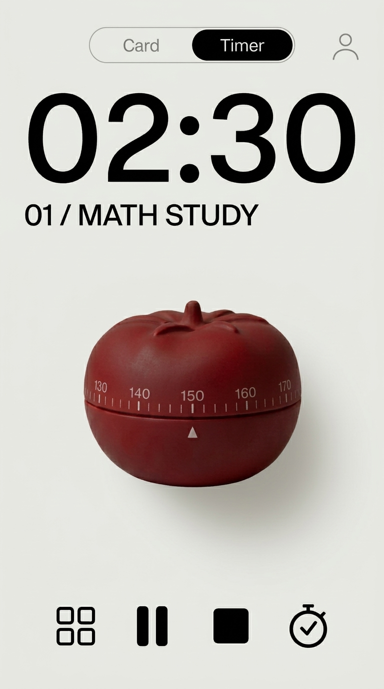
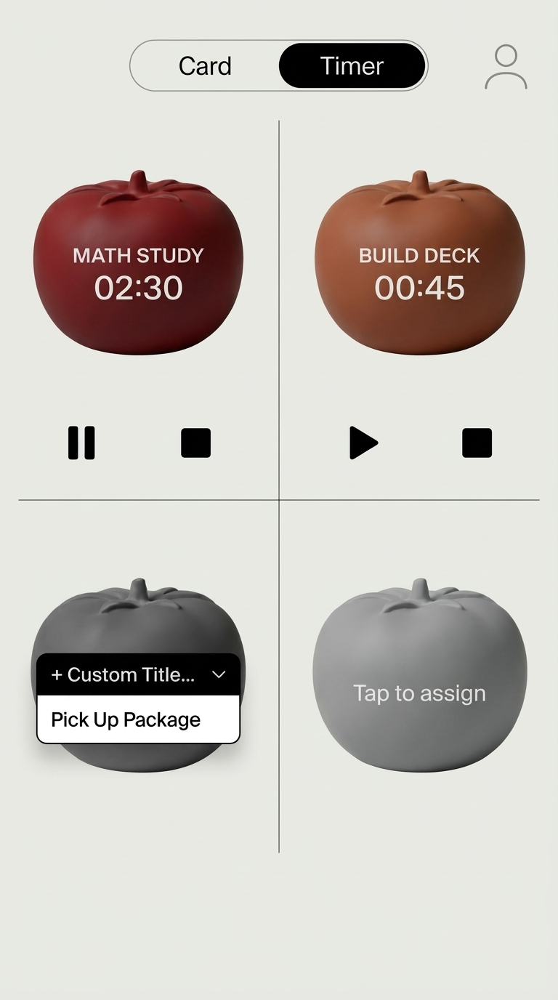
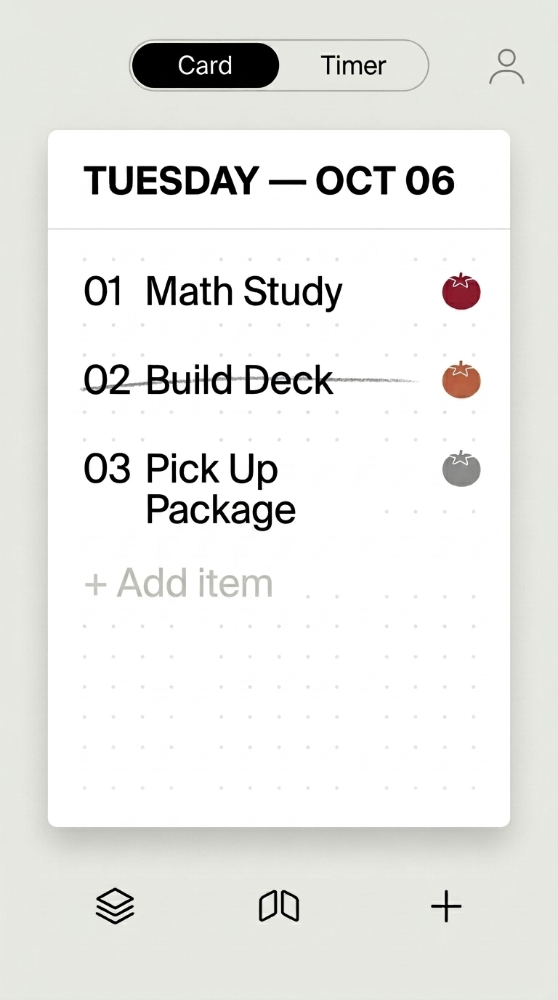
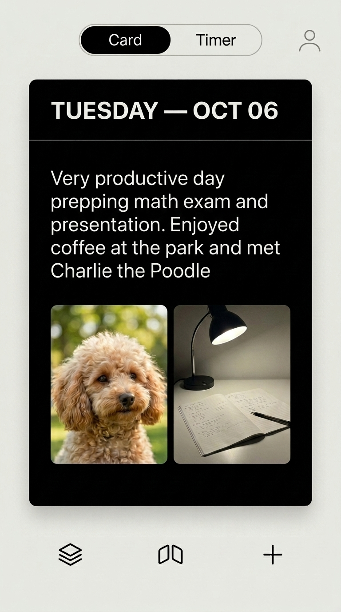
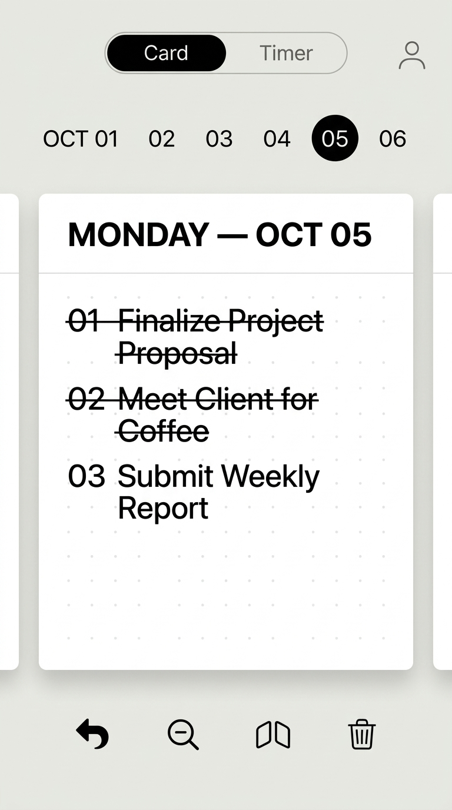
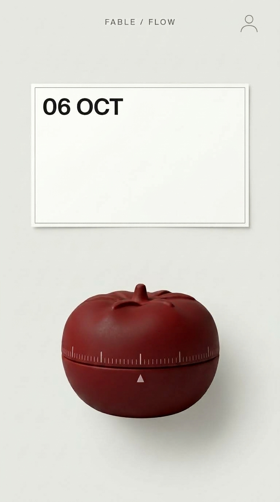

# Product Requirements Document (v4): Fable / Flow

**Target Platform:** iOS 17.0+ (`Swift` / `SwiftUI` / `RealityKit` & `Metal` / `CoreHaptics` / `SwiftData` / `CloudKit` / `ActivityKit` / `StoreKit 2`)

## 1. Idea & Background

**A tactile, digital-analog tool space that increases a user's sense of lived fulfillment by restoring daily focus, accomplishment, and presence without coercive gamification, complex hierarchies, or productivity guilt.**

Modern productivity applications force users to choose between fragmented "app stacks" (e.g., *Todoist + Forest + Day One*) that induce high context-switching friction, or monolithic "all-in-one" systems (e.g., *Notion, Asana, TickTick*) that demand steep onboarding curves and end up creating cognitive overload.

Project **Fable / Flow** bridges this divide by delivering a calm, hyper-minimalist, physical-first environment. Built around two tactile objects—a **dual-sided index card** and a **3D heirloom tomato Pomodoro timer**—it replaces abstract dashboards with organic, physical tools for daily planning, deep focus, and evening reflection.

## 2. Goals, Guiding Principles & Explicit Non-Goals

### Goals

- **User Value:** The tools are first and foremost functional and helpful. The experience provides stress-free cognitive grounding through calm, tactile interaction. Users leave feeling fulfilled by concrete daily accomplishments rather than trapped in digital maintenance loops.
- **Product & Business Value:** An "anti-tech," sensory-rich interface model on iOS that achieves strong organic retention through intrinsic tactile delight rather than addictive games, monetized via a transparent 7-day trial and hybrid subscription / one-time lifetime unlock.

### Guiding Principles

- **Simplicity Over Systems:** Reality is where life happens, not inside an app. Tools are single-purpose, obvious, and devoid of multi-level configuration menus.
- **Tactile & Organic Skeuomorphism:** Digital objects obey physical intuition—they twist and unwind with stepped haptic resistance, cross out with audible graphite friction, flip with crisp cardstock weight, and settle with natural mass.
- **Zero-Guilt Architecture:** No broken streak penalties, no automatic rollover of unfinished tasks piling up, no red overdue badges, no performance/analytics charts, and no anxiety-inducing marketing/guilt push notifications.
- **Local-First & Ephemeral Option ("Goldfish Mode"):** Complete utility without forced account creation. Users operate locally without cloud sync by default, and free-tier users after the trial retain a 1-card, 1-timer daily experience without losing their previously archived trial cards on-device.

### Explicit Non-Goals

- **Not a Complex Project Management Suite:** No Gantt charts, subtasks, task dependencies, team assignments, or Kanban boards (e.g., *Asana / Trello / Lunatask*). Tasks are strictly flat and capped at **6 main tasks per card**.
- **No Automatic Task Rollover:** If a user does not finish a task by the end of the day (5:00 AM cutoff), it remains uncrossed on that day's card as an honest snapshot in the archive rather than rolling over to clutter tomorrow's card.
- **Not a Behavioral Habit Tracker or Analytics Dashboard:** No mandatory 66-day habit loops, streak counts, focused-hour trend graphs, or dopamine-driven conditioning (e.g., *Fabulous / Habi*).
- **Not a Clinical Wellness/Meditation App:** No guided meditation voice tracks or generic daily affirmations (e.g., *Calm*).
- **No Generative AI Rewriting:** Thoughts and reflections remain 100% the user's own authentic words—no AI text generation or automated summarizing.

## 3. Business & Monetization Model

- **Free-to-Download with 7-Day Full-Access Trial:** New users receive 7 days of unrestricted access immediately upon download (no upfront paywall or credit card required) to build their first week-long **Card Stack** (up to 6 tasks/day, all 4 Pomodoro timers, Back-of-Card evening journal with up to 2 photos, Stack & Calendar archive).
- **Hybrid Paywall (Post-Trial Unlock via StoreKit 2):**
  - **Monthly Subscription:** Low-commitment recurring access.
  - **Annual Subscription:** Discounted yearly access.
  - **Lifetime One-Time Purchase:** Positioned as *"Buy Your Physical Tools Once"* for users who prefer ownership over subscriptions.
- **Free Tier Fallback ("Goldfish Mode"):** If a user chooses not to purchase after the 7-day trial, the app remains functional in a constrained daily mode: **1 Daily Card (Front To-Do List)** and **1 Pomodoro Timer (Top-Left Quadrant #1)** per day, resetting fresh at 5:00 AM each morning without historical Stack access, Back-of-Card journal access, or multi-device CloudKit sync. *(Cards and photos created during the 7-day trial are never deleted; they remain encrypted on-device and unlock immediately if the user subscribes or purchases Lifetime later.)*

## 4. End-to-End User Journey

1. **Morning Intake (5:00 AM Daily Reset):** The user opens the app in the morning. At **5:00 AM local time**, yesterday's card was automatically filed into the **Card Stack**, and a fresh white index card is ready on the minimalist homepage (stamped `06 OCT` in miniature). Tapping the Card zooms smoothly into Today's White Index Card stamped `TUESDAY — OCT 06`. The user taps into the task lines (or taps `+ Add item` / the bottom-right `[+]` button) to write three main tasks: `01 Math Study`, `02 Build Deck`, and `03 Pick Up Package` (up to 6 main tasks max; no subtasks).
2. **Focus Execution (Bidirectional 3-Turn Odometer Dial):** The user taps the small heirloom tomato icon next to `01 Math Study`, smoothly expanding into the **Single Big Hero Tomato** view labeled `01 / MATH STUDY`. They drag the tomato dial horizontally **Right → Left** in 5-minute (`30°`) notched increments to wind the timer (up to 180 minutes via 3 full rotations; if they overshoot, dragging **Left → Right** unwinds the dial in 5-minute notched steps). A subtle mechanical ticking haptic and escapement sound engage as the tomato begins unwinding.
3. **Interruption & Multi-Tomato Switching:** 15 minutes in, an urgent interruption arrives. The user taps **Pause (`||`)** on `01 Math Study` and taps the bottom-left **`[2×2 Grid Icon]`** to return to the **4-Pomodoro Grid View**, where four heirloom tomatoes sit in a `2×2` layout divided by subtle crosshairs (assigned tomatoes appear in distinct shades of red with inline `Play ▶ / Pause ||` and `End ■` controls below them, while unassigned tomatoes remain matte gray). While `Math Study` holds its paused state on Tomato #1, the user taps an unassigned gray tomato, selects `Pick Up Package` (or `Build Deck`) from the dark dropdown menu (`+ Custom Title...` + today's tasks), which turns that tomato into its signature shade of red. In the Hero View, they toggle the **Stopwatch (`⏱`)** button for an open-ended session and tap **Play (`▶`)**. The tomato physically rotates forward (`1 minute notch per minute`) as time counts up.
4. **Ending a Timer & Pixel-Locked Tactile Strikethrough:** The user finishes the deck and taps **End (`■`)** on the tomato, which resets that tomato's clock back to `00:00` (if a countdown reaches `00:00` on its own—whether in the foreground or locked in the background—a soft completion chime plays). Because timer completion is intentionally decoupled from task completion, the user switches back to the Card via the top `Card | Timer` pill and drags their finger horizontally **Left → Right** (`Δx > +15 px`) across `02 Build Deck`. A realistic graphite line follows their finger with pencil-scratch haptics and sound. (If they cross out an item by mistake, dragging **Left → Right** across it again erases the strikethrough.)
5. **Evening Reflection (The Right-to-Left Flip):** At night, the user swipes **Right → Left** (`Δx < -40 px`) across the card body (or taps the bottom-center `[Flip Icon]`) to turn the card `180°` over in 3D space to its **matte black reverse side** stamped `TUESDAY — OCT 06`. The user types a reflection and taps the `[+ Photo]` squares (or bottom-right `[+]` button) to attach up to 2 photos from the afternoon. As they type longer text, the typography dynamically scales down to fit the card frame, only becoming scrollable if the text reaches the `13pt` minimum font size floor.
6. **Effortless Archiving, Retroactive Edits & Permanent Trash Deletion:** The user goes to sleep without needing to manually file the card. At **5:00 AM**, the card is automatically available in the **Card Stack** and a fresh card is placed on the workspace. If the user forgot to write their reflection the night before, they can tap the bottom-left `[Stack Icon]` at any time, select yesterday's card from the top date strip (`OCT 01 02 03 04 (05) 06`), and edit its front or back retroactively—or tap the bottom-right `[Trash Can 🗑]`, confirm permanent deletion in the alert dialog, and receive a confirmation notification banner that the card was permanently removed.

## 5. Information Architecture & Page Navigation

- **Minimalist Homepage:**
  - Top Bar: Centered `'FABLE / FLOW'` title and top-right `[Profile Icon]`.
  - Canvas: Displays the Physical Card (stamped `06 OCT`) and 3D Tomato resting on a warm off-white canvas (`#EAE8E1`).
  - Tapping the Card opens **Today's Card (Front)**.
  - Tapping the Tomato opens the **4-Pomodoro Grid View (`2×2`)**.
- **Global Top Bar (Present Inside Card, Timer, Stack & Calendar Views):**
  - **Centered `Card | Timer` Segmented Pill:** One-tap toggle between the active Card view and the Pomodoro Timer view.
  - **Top-Right `[Profile Icon]`:** Opens the Account & Settings modal (Sign in with Apple, CloudKit sync toggle, ambient escapement sound toggle, subscription management; strictly no trackers or analytics trends).
- **Card Views Navigation:**
  - **Front of Today's Card (White) ↔ Back of Today's Card (Matte Black):** Switch via `Right → Left` swipe gesture (`Δx < -40 px`) on the card body or by tapping the bottom-center `[Flip Icon]`.
  - **Today's Card → Single Big Hero Tomato:** Tap the small heirloom tomato icon on the right side of any task row.
  - **Today's Card → Card Stack Viewer (Archive):** Tap the bottom-left `[Stack Icon]`.
  - **Card Stack Viewer → Today's Card:** Tap the bottom-left `[Return / Undo Arrow ↩]`.
  - **Card Stack Viewer ↔ Monthly Calendar View:** Pinch fingers inward or tap the bottom center-left `[Zoom Out Magnifying Glass 🔍-]` icon to zoom out to the Calendar View; tap any highlighted date on the calendar (or tap the bottom-right `[Zoom In Magnifying Glass 🔍+]` icon) to open that date's card in the Stack Viewer.
- **Timer Views Navigation:**
  - **4-Pomodoro Grid View (`2×2`) → Single Big Hero Tomato View:** Tap any assigned tomato body (or assign a task via dropdown and tap the tomato).
  - **Single Big Hero Tomato View → 4-Pomodoro Grid View (`2×2`):** Tap the bottom-left `[2×2 Grid Icon]`.

## 6. Detailed Functional Requirements

### #1. Minimalist Homepage & Global Navigation Bar

- **Homepage Visual Representation:**
  - Warm off-white textured canvas (`#EAE8E1`) displaying two physical objects resting on the surface:
    1. **The Daily Card:** Crisp white horizontal cardstock in a subtle frame, stamped in the top-left with `06 OCT` (`DD MMM` uppercase).
    2. **The Tomato Pomodoro:** Tactile 3D heirloom tomato timer in Deep Crimson Red with equatorial tick notches and white pointer triangle (`▲`).
- **Global Top Bar:**
  - Centered `'FABLE / FLOW'` title on Homepage; morphs into centered `Card | Timer` segmented pill inside Card/Timer/Stack/Calendar views.
  - Top-Right `[Profile Icon]`: Opens minimal account sheet (Sign in with Apple, opt-in CloudKit sync toggle, subscription management; strictly zero analytics charts, focus hour trackers, or trend graphs).

### #2. Pillar 1: Flow / Engagement (The 4-Pomodoro Timer)

#### A. The 4-Tomato Grid View (`2×2` Layout)

- **Visual Representation:** Balanced `2×2` grid of four 3D rendered Pomodoro timers separated by subtle horizontal and vertical crosshair lines.
- **Unassigned Gray vs. Assigned Distinct Shades of Red:**
  - **Unassigned State:** Matte neutral gray (`#8E8D8A`) with a subtle centered `Tap to assign` label.
  - **Assigned State:** Transitions from gray into its quadrant's distinct heirloom shade of red, displaying the uppercase Task Title and Digital Readout (`MATH STUDY / 02:30`) centered on the tomato body, plus inline `[Play ▶ / Pause ||]` and `[End ■]` controls directly below that tomato:
    1. **Top-Left Tomato:** Deep Crimson Red (`#8B1E24`)
    2. **Top-Right Tomato:** Warm Terracotta / Vermilion Red (`#C84B31`)
    3. **Bottom-Left Tomato:** Rich Dark Burgundy / Wine Red (`#5E192A`)
    4. **Bottom-Right Tomato:** Sun-Ripened Coral / Dusty Rose Red (`#D96B52`)
- **Task Assignment & Renaming:**
  - Tapping an unassigned gray tomato (`Tap to assign`) or tapping an existing tomato's title opens a dark floating dropdown menu directly over the tomato listing `+ Custom Title...` at the top followed by the current tasks from Today's Card (e.g., `Pick Up Package`), plus an option to clear/unassign.
  - If a tomato's title is cleared completely, the tomato immediately returns to its unassigned matte gray state.
- **4-Timer Concurrency & Controls (`Play ▶`, `Pause ||`, `End/Reset ■`):**
  - Up to 4 timers can hold an assigned/paused state concurrently. **Only 1 timer can actively tick at the same time** (starting one automatically pauses any other running timer).
  - **Pause (`||`):** Freezes the timer at its current countdown or stopwatch value.
  - **End / Reset (`■`):** Ends the focus session and resets the clock back to `00:00`.
  - **Decoupled Task Strikethrough:** A timer reaching `00:00` or being ended via `■` **never** automatically crosses out the corresponding task on the Card. Crossing off a task is always an intentional, manual `Left → Right` pencil-drag action by the user on the Card.

#### B. Single Big Hero Tomato View & Bidirectional Dial Physics

- **Entering & Exiting the Hero View:**
  - Tapping an assigned tomato in the `2×2` grid (or tapping the small tomato icon next to a task on the Card) zooms smoothly into the **Single Big Hero Tomato View**, displaying the large left-aligned digital readout (`02:30`), the uppercase task title (`01 / MATH STUDY`), and the large 3D tomato in its corresponding shade of red.
  - **Bottom Control Bar (4 Icons):**
    1. **Bottom-Left `[2×2 Grid Icon]` (`⊞`):** Returns to the 4-Tomato Grid View.
    2. **Center-Left `[Play ▶ / Pause ||]`:** Starts or pauses the clock.
    3. **Center-Right `[End / Reset ■]`:** Resets the clock to `00:00`.
    4. **Bottom-Right `[Stopwatch Toggle ⏱]`:** Switches the timer between Countdown Mode and Count-Up Stopwatch Mode.
- **Countdown Mode — Bidirectional 180-Minute "3-Turn Odometer" Dial:**
  - **Winding (`Right → Left` Drag):** Dragging horizontally right-to-left across the tomato body winds the timer up in **5-minute notched increments** (`30°` per 5-min notch; `12` clicks = `360°` = `60 minutes`), up to a maximum of **180 minutes (3 full rotations / `1080°`)**.
  - **Unwinding (`Left → Right` Drag):** Dragging horizontally left-to-right across the tomato body unwinds/decrements the timer in **5-minute (`30°`) notched steps** down to `00:00`.
  - **3-Turn Odometer Shader Mechanics:** As the user rotates past 60 minutes into Turn 2 (`65–120 mins`) or Turn 3 (`125–180 mins`)—or unwinds back down—the painted numbers rolling into view from behind the 3D tomato dynamically increment/decrement via Metal shader (`0–60` on Turn 1, `65–120` on Turn 2, `125–180` on Turn 3, e.g., `130 140 150 160` above the white `▲` pointer).
  - **Unwinding & Completion Chime (Foreground & Background):** As time counts down, the tomato slowly unwinds backward toward `0` and plays a soft completion chime (`soft_chime.caf`) at `00:00`—both in the foreground and when backgrounded/locked via a synchronized local notification sound.
- **Count-Up Stopwatch Mode — Continuous Forward Rotation:**
  - Tapping `[Stopwatch Toggle ⏱]` sets the timer to `00:00` in count-up mode.
  - While counting up, the 3D tomato **physically rotates forward** at a real-time pace (`1 minute notch / +6° per minute`) with the subtle mechanical escapement tick.
- **Live Activity, Dynamic Island & Ambient Desk Mode:**
  - When backgrounded or locked, the active countdown or stopwatch projects live status to iOS Live Activities and the Dynamic Island.
  - When left open on a desk stand while running, Ambient Desk Mode keeps the screen awake (`isIdleTimerDisabled = true`) as the active tomato slowly rotates in real time.

### #3. Pillar 2: Purpose & Presence (The Dual-Sided Card & Stack)

#### A. Daily Card Lifecycle & Automatic 5:00 AM Rollover

- **Automatic Stack Saving:** Every card is automatically saved in the chronological Card Stack in real time.
- **5:00 AM Daily Boundary:** At **5:00 AM local time** each day (`currentTime - 5 hours`), the workspace automatically transitions to a fresh, blank white index card stamped with the new date, while the previous day's card resides in the Stack.
- **No Unfinished Task Rollover:** Tasks not crossed out before 5:00 AM stay uncrossed on yesterday's card in the Stack and **do not** copy over to the new card.
- **Always Editable History:** Users can open any past card in the Stack at any time to edit task text, cross/uncross tasks, write or update their evening reflection, or add/change photos.

#### B. Front of Card — Purpose / Accomplishment (White To-Do Card)

- **Visual Representation:** Crisp, textured white index card (`#FAF9F5`) stamped at the top-left with `TUESDAY — OCT 06` above a subtle horizontal divider line.
- **Strict 6-Task Limit & `+ Add item` Row (No Subtasks, No Vertical Scroll):**
  - Supports a flat list of maximum **6 main tasks (`01` through `06`)** with zero vertical scrolling.
  - When fewer than 6 tasks exist, displays a muted gray **`+ Add item`** row below the last task.
- **Editing Tasks:** Tapping directly on any task line (or `+ Add item` / bottom-right `[+]`) opens the keyboard to type or edit the task text in place.
- **Pixel-Locked Pencil Strikethrough & Erase Gesture (`Left → Right` Only):**
  - **Pixel Math Rule:** Triggered strictly when a finger drag begins inside a task row and moves horizontally **Left → Right** with `Δx > +15 px` and vertical angle within `±25°` (`|Δy| <= Δx * tan(25°)`).
  - **Cross Out:** Dragging `Left → Right` across an uncrossed task draws a dynamic, textured graphite pencil line following the finger's pixel path with pencil-scratch haptics and audio.
  - **Un-Cross (Erase):** Dragging `Left → Right` across an already crossed-out task removes/erases the pencil strikethrough.
- **Cross-Pillar Tomato Link:** A small 3D heirloom tomato icon sits on the right side of each task row (red when assigned to a timer, matte gray when unassigned); tapping it opens `SingleHeroTomatoView` synced to that task.
- **Today's Card Bottom Bar (3 Icons):**
  1. **Left `[Stack Icon]`:** Opens the chronological Card Stack Viewer.
  2. **Center `[Flip Icon]`:** Flips Today's Card `180°` between Front (White) and Back (Matte Black).
  3. **Right `[+ Plus Icon]`:** Focuses/adds the next empty task slot on the Front (up to 6 max), or adds a photo / focuses reflection text on the Back.

#### C. Back of Card — Presence / Mindfulness (Matte Black Journal Card)

- **Pixel-Locked Card Flip Interaction (`Right → Left` Only):**
  - **Pixel Math Rule:** Triggered when a finger swipe moves horizontally **Right → Left** anywhere on the card body with `Δx < -40 px` and vertical angle within `±35°` (`|Δy| <= |Δx| * tan(35°)`), or when tapping the bottom-center `[Flip Icon]`. Rotates the card `180°` in 3D space accompanied by a cardstock-flip haptic and paper-whoosh audio cue.
- **Visual Representation:** Inverts to a calm matte black card (`#141413`) with clean white text (`#FAF9F5`), stamped at the top-left with `TUESDAY — OCT 06` above a subtle divider line.
- **Adaptive Typography, Optional Photos & Scroll Threshold:**
  - **Dynamic Font Scaling → Scroll Fallback:** As the user enters more journal text, the typography automatically scales down from `20pt` to a **`13pt` minimum legible floor** so longer reflections fit comfortably within the card frame. Once the text reaches `13pt` and exceeds the card frame, the text area locks at `13pt` and becomes vertically scrollable.
  - **Optional Photo Slots (0 to 2 Images):** Users can attach up to 2 photos framed side-by-side at the bottom of the black card. When 0 or 1 photo is attached, compact minimal `[+ Photo]` square buttons allow adding photos while letting text occupy the remaining space.

#### D. Card Stack Viewer & Calendar View

- **Stack Detail View (Archived Cards):**
  - Displays a horizontal chronological date strip at the top (`OCT 01   02   03   04   (05)   06`) with a solid black circle on the selected date (`05`).
  - Displays the selected card in center focus with peeking neighbor card edges on left/right.
  - **Archived Card Bottom Bar (4 Icons):**
    1. **Left `[Return / Undo Arrow ↩]`:** Immediately returns the user to Today's current card.
    2. **Center-Left `[Zoom Out Magnifying Glass 🔍-]`:** Zooms out to the Monthly Calendar View (also triggered by pinching two fingers inward).
    3. **Center-Right `[Flip Icon]`:** Flips the archived card `180°` between Front and Back.
    4. **Right `[Trash Can 🗑]`:** Prompts a confirmation modal (*"Permanently delete this card? This action cannot be undone."*). Upon confirmation, **permanently deletes** the card from storage and pops up an in-app confirmation notification banner (*"Card permanently deleted"*).
- **Calendar Zoom-Out View:**
  - Displays vertically stacked monthly calendars (`SEPTEMBER 2026`, `OCTOBER 2026`) with soft gray circles on dates that have archived cards and a solid black circle on the currently selected date.
  - **Calendar Bottom Bar (2 Icons):**
    1. **Left `[Return / Undo Arrow ↩]`:** Immediately returns the user to Today's current card.
    2. **Right `[Zoom In Magnifying Glass 🔍+]`:** Zooms into the selected date's card in the Stack Detail View (also triggered by tapping any highlighted date on the calendar).

## 7. Complete Gesture, Haptic & Audio System

### Gesture & Navigation Summary Table

| Screen / Context | User Input / Gesture | System Action |
| :--- | :--- | :--- |
| **Homepage** | Tap Card (`06 OCT`) / Tap Tomato | Smoothly zooms into Today's Card or the 4-Pomodoro Grid View |
| **Global Top Bar** | Tap `Card \| Timer` Pill | Instantly switches between active Card view and Timer view |
| **Global Top Bar** | Tap Top-Right `[Profile Icon]` | Opens Account / Sign in with Apple / CloudKit Sync modal (no trackers/trends) |
| **Card (Front & Back)** | Swipe `Right → Left` (`Δx < -40 px`) on card or tap center `[Flip Icon]` | Flips the card `180°` in 3D space between White Front (To-Do) and Matte Black Back (Journal) |
| **Card (Front Task Row)** | Tap on task text / `+ Add item` / bottom-right `[+]` | Opens keyboard to type or edit the task title in place (up to 6 tasks max) |
| **Card (Front Task Row)** | Drag `Left → Right` (`Δx > +15 px`) on task row | Draws textured graphite pencil strikethrough following finger path (or erases strikethrough if already crossed out) |
| **Card (Front Task Row)** | Tap small tomato icon on right of row | Opens Single Big Hero Tomato synced to that task |
| **Card (Back Journal)** | Tap text area / Tap `[+ Photo]` or bottom-right `[+]` | Types reflection (font auto-shrinks from `20pt` to `13pt` floor, then scrolls) or attaches 1–2 compressed HEIC photos |
| **Card (Bottom Bar)** | Tap Left `[Stack Icon]` | Opens chronological Stack Viewer of past cards |
| **Stack Viewer** | Tap `[Return ↩]` / `[Zoom Out 🔍-]` / `[Flip]` / `[Trash 🗑]` | Returns to Today's Card / Zooms out to Calendar / Flips archived card / Prompts permanent delete confirmation + pops up deletion notification |
| **Stack Viewer** | Pinch inward (or tap `[Zoom Out 🔍-]`) | Zooms out to Monthly Calendar View; tapping a highlighted date or `[Zoom In 🔍+]` enters that card |
| **4-Tomato Grid View** | Tap unassigned gray tomato or assigned tomato title | Opens dark task assignment dropdown (`+ Custom Title...` + Today's tasks) |
| **4-Tomato Grid View** | Tap assigned red tomato body | Zooms into Single Big Hero Tomato View for that quadrant |
| **Single Hero Tomato** | Drag `Right → Left` or `Left → Right` across tomato body | Winds (`Right → Left`) or unwinds (`Left → Right`) countdown in 5-min (`30°`) steps between `00:00` and `180:00` (3-turn odometer: 60m per `360°` turn) |
| **Single Hero Tomato** | Tap `[2×2 Grid]` / `[Play ▶ / Pause \|\|]` / `[End ■]` / `[Stopwatch ⏱]` | Returns to `2×2` Grid / Starts or pauses timer / Resets clock to `00:00` / Toggles forward-rotating Stopwatch mode |

### Haptic & Audio Matrix

| Action & Gesture Direction | Visual Effect | Haptic Pattern (`CoreHaptics`) | Audio Design (`AVAudioEngine`) |
| :--- | :--- | :--- | :--- |
| **Winding (`Right → Left`) or Unwinding (`Left → Right`) Hero Tomato (`0m–180m`)** | 3D rotational `30°` notch alignment; Metal shader dynamically updates numbers (`0–60`, `65–120`, `125–180`) | Continuous stepped mechanical clicks (`30°` / 5-min notch) | Soft mechanical ratchet tick on twist; optional escapement tick while running; soft chime at `00:00` (foreground & background) |
| **Striking Out / Un-crossing Task (`Left → Right` Pixel Drag, `Δx > +15 px`)** | Textured graphite line dynamically follows finger path from left to right (or erases cleanly on second `Left → Right` drag) | Sharp transient pencil contact impact + continuous velocity-modulated drag friction | Subtle graphite pencil stroke on heavy cardstock paper |
| **Flipping the Card (`Right → Left` Swipe, `Δx < -40 px`, or `[Flip Icon]`)** | 3D `180°` cardstock rotation (`White Front ↔ Matte Black Back`) | Crisp mid-weight transient lift + soft landing thud | Subtle heavy cardstock paper flip whoosh |
| **Thumb-Scrolling the Card Stack Date Strip / Carousel** | Chronological cards riffle and snap into center focus | Light crisp transient tick per card passed | Authentic cardstock sliding and settling sound |
| **Deleting Archived Card via `[Trash Can 🗑]`** | Confirmation modal → card removed from stack + pop-up confirmation banner notification | Subtle warning double-tap on prompt; crisp paper-crumple transient on confirm | Soft paper tear/discard audio cue |

## 8. Success Metrics

- **Happiness:** Users enjoy the sensory craft; tactile engagement with signature interactions (`Left → Right` pencil drag, `Right → Left` card flip, bidirectional 3-turn tomato twist).
- **Engagement:** Percentage of active users completing the full daily loop (Front tasks created → Pomodoro focus session run → Back reflection written).
- **Adoption & Conversion:** Trial-to-paid conversion rate after the 7-day trial across Monthly, Annual, and Lifetime tiers.
- **Retention:** D7, D30, and D90 cohort retention.

## 9. Scope & Phased Implementation Roadmap

- **Phase 1 — Beta (`v0.2.0-beta` — Core Tactile Loop: Card Front + 4-Pomodoro Timer):**
  - **Front of Today's Card:** Max 6 main tasks (no subtasks), `+ Add item` row, 3-icon bottom bar (`[Stack]`, `[Flip]`, `[+]`), tap-to-edit, pixel-locked `Left → Right` pencil strikethrough/erase gesture, and small tomato task triggers.
  - **4-Pomodoro Timer (`2×2` Grid) & Single Hero Tomato:** Unassigned tomatoes in matte gray, assigned tomatoes in 4 distinct shades of red; bidirectional 180-minute 3-turn odometer countdown dial with Metal shader numbers; forward-rotating Count-Up Stopwatch mode; `Play`/`Pause`/`End (Reset)` controls; background completion chime notification; and 4-icon Hero bottom bar.
  - **Sensory Engine:** Full `CoreHaptics` and silent-safe mixed audio implementation with encrypted local `SwiftData` storage.
- **Phase 2 — MVP (`v0.5.0-mvp` — Complete Daily Ritual & Memory Archive):**
  - **Minimalist 2-Object Homepage** (`FABLE / FLOW` + `06 OCT` mini-card + 3D Tomato) and global `Card | Timer` navigation pill.
  - **Back of Card (Matte Black Journal):** Pixel-locked `Right → Left` 3D flip gesture, dynamic font scaling down to `13pt` floor with scroll fallback, and 1–2 optional `1600px` HEIC photo attachments.
  - **Automatic 5:00 AM Daily Rollover, Stack Viewer & Pinch-to-Zoom Calendar View:** Including retroactive editing of past cards, 4-icon Stack bottom bar (`[Return ↩]`, `[Zoom Out 🔍-]`, `[Flip]`, `[Trash 🗑]`), permanent delete confirmation dialog + pop-up notification banner, and 2-icon Calendar bottom bar (`[Return ↩]`, `[Zoom In 🔍+]`).
- **Phase 3 — V1 (`v1.0.0-rc1` — Cloud Sync, Monetization & System Integration):**
  - **Top-Right Profile Modal & Account Auth:** Sign in with Apple and opt-in **CloudKit Sync** across devices (strictly no trackers/trend graphs).
  - **Monetization:** 7-Day Free Trial, Hybrid Paywall (Monthly, Annual, Lifetime), and non-destructive post-trial Free Fallback ("Goldfish Mode": 1 Card + 1 Timer per day).
  - **iOS System Surfaces & Accessibility:** Live Activities, Dynamic Island integration, Lock Screen widgets, Ambient Desk Mode, and full VoiceOver custom actions.

## 10. UI Mockups

*Home Page (HD) — Center-Aligned 'FABLE / FLOW', Profile Icon, '06 OCT' Card & 3D Tomato*

*Detailed Timer Page — Single Big Hero Tomato View with 3-Turn Odometer Numbers & 4-Icon Bottom Bar*

*Set of Timer Page — 4-Tomato 2x2 Grid View with Crosshairs, Inline Controls & Task Assignment Dropdown*

*Front of Card — White To-Do Card with Numbered Tasks, Strikethrough, Tomato Triggers, '+ Add item' & 3-Icon Bottom Bar*

*Back of Card — Matte Black Evening Reflection Journal with 2 Framed Photos & 3-Icon Bottom Bar*

*Stack Detail — Chronological Date Strip, Archived Card Carousel & 4-Icon Bottom Bar (Return, Zoom Out, Flip, Trash)*

*Stack of Cards (Zoomed Out to Calendar View) — Monthly Grids with Highlighted Dates & 2-Icon Bottom Bar*

## 11. Technical & Architecture Considerations

- **Unified 3D Scene with Adaptive FPS:** Utilize a single unified 3D tomato scene with custom Metal shader-driven lighting and dynamic number odometer textures that throttles its render loop to **`0 fps` (static snapshot)** when paused/idle, **`15 fps`** during slow ambient countdown/stopwatch rotation, and **`60–120 fps` (ProMotion)** during active timer twist and `180°` card-flip interactions.
- **Zero-Knowledge Local Storage:** All cards, timer states, journal text, and attached photos are stored in an encrypted on-device `SwiftData` database (`FileProtectionType.completeUntilFirstUserAuthentication` to support background Live Activities and the 5:00 AM rollover safely) unless the user signs in via Sign in with Apple in the top-right Profile icon and opts into `CloudKit` sync.
- **Storage Bloat in Local-First Architecture:** Enforce strict client-side image compression (`HEIC` format, max `1600px` dimension, max 2 images per card) before persisting to `SwiftData`/`CloudKit`.
- **Hardware Silent Mode & Audio Mixing:** Respect the iOS Silent Mode switch for sound effects while preserving full `CoreHaptics` feedback, and mix audio cleanly (`AVAudioSession.Category.ambient` + `AVAudioSession.CategoryOptions.mixWithOthers`) so tactile sound effects never interrupt a user's background music or podcasts during focus sessions.
- **Accessibility:** All 3D timers, `Left → Right` pencil strikethrough gestures, `Right → Left` card-flip gestures, and Stack/Calendar views include full VoiceOver accessibility labels, single-tap screen reader alternatives, high-contrast legibility, and Dynamic Type support.
